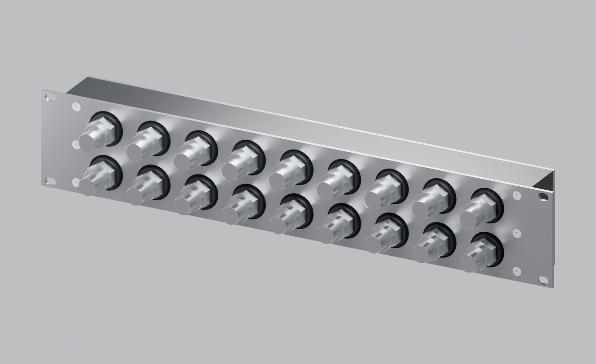

# RM8-2U rack coolant manifold

**Design iterations:** [G is preserved](docs/iterations.md) under tag `revision-g-rear-cover` (`8ebd431`). [New revision H](docs/long-bore-H.md) is a separate long-bore design with four plugged G1/4 end ports, no rear plate and no large gallery seals. The baseline G files and description below remain intact.

Initial design, revision G: eight parallel circuits, all connections on one face, black Delrin body and a flat stainless steel rack faceplate. Each G1/4 female port is inside an integral cylindrical POM boss, standing 3 mm proud of the steel. The 2U format provides space to operate QD3 release rings without crowding adjacent fittings.



| Parameter | Initial model |
|---|---|
| Bare rack envelope | 482.6 × 49 × 87 mm (width × depth × height) |
| Ports |18 × G1/4 female BSPP, machined into Delrin |
| Circuits |8 paired branches plus main inlet/outlet |
| Port pitch |45 mm horizontal /40 mm vertical |
| Reference pull-ring gaps |21.3 mm horizontal /16.3 mm vertical |
| Internal paths |One uninterrupted supply gallery and one uninterrupted return gallery |
| Manufacture |Rear-pocket milling, drilled/tapped front ports, sealed stainless rear cover, flat stainless faceplate |

The dimensions of EK's reference manifold are 326 × 57 × 36 mm; its published 57 mm height is 12.55 mm above 1U. Our model uses 2U to prioritise servicing access. See [design reasoning](docs/design.md) and [manufacturer sources](docs/sources.md).

## Selected mounting arrangement — Option B

The front faceplate fixes the POM body to the rack through eight M4 screws. The separate rear plate only closes and seals the two galleries, using 31 M4 screws. All 39 plate-to-POM screws use A4 M4 × 12 DIN 7991 socket countersunk heads as standard, accepting the specified DIN 965 Z Pozi alternative. There are no M3 or M5 fasteners in these joints. Rack fixings remain sized to the rails/cage nuts.

The former combined rack/backing plate, [Option C](docs/backplate.md), is retained as a historical reference and is not selected.

## Review files

- [Eight unmarked assembled product views](docs/product-views.md) — front/rear three-quarter, front, rear, left, right, top and bottom.
- [Unmarked Blender assembly](output/product-views/assembled-unmarked.blend) — CAD-derived POM and steel, 39 M4 screw references, eighteen male QD3 references and eight named cameras.
- [Earlier technical review scene](output/manifold-review.blend) — annotated views with illustrative hose connections.
- [Assembly STEP](output/cad/manifold-assembly.step) — three manufactured components and two seal envelopes. Individual body, cover and faceplate STEP files are alongside it.
- [Front plate drawing](output/faceplate-drawing.svg) and [cut DXF](output/cad/faceplate-flat.dxf).
- [Rear sealing plate drawing](output/rear-cover-drawing.svg) and [cut DXF](output/cad/rear-cover-flat.dxf) — 31 Ø4.5 through holes; machine countersinks afterwards.
- [Wetted rear-plate material assessment](docs/wetted-materials.md) — retain 316L with compatible inhibited coolant.
- [Steel plate drafting notes](docs/steel-plates.md) — hole coordinates, finishing and matching STEP files.
- [POM body and cylindrical port bosses](output/images/pom-body.png).
- [Faceplate exploded view](output/images/faceplate-exploded.png).
- [Port seating section](output/port-seating-section.svg).
- [Dimensioned layout](output/layout.svg) — front and rear views.
- [Full-size clearance template](output/clearance-template-1to1.svg) — print 100%, calibrate against the 100 mm bar; large-format or tiled print required.
- [Rear pockets, cover removed](output/images/open-galleries.png).
- [Rear groove detail](output/images/rear-seal-review.png) and [stock-ring assessment](docs/rear-seals.md) — 4.0 × 2.3 mm glands for the selected Polymax 3 mm EPDM rings.
- [Manufacturing notes and BOM](docs/manufacturing.md) — thread call-outs, sealing details, fasteners and DFM requirements.
- [Geometry verification](output/cad/verification.json).
- [Gallery and seal architecture comparison](docs/gallery-comparison.md) — end-drilled galleries versus the current rear-milled pockets; assessment only.
- [D5 pressure estimates](docs/d5-pressure.md) — one, two or four pumps in series; pump differential versus local seal pressure.

This is an initial model for feedback and vendor DFM, not a pressure-rated production release. STEP thread holes are pilot bores: use the thread call-outs in the manufacturing notes. QD shapes are illustrative, and actual ring travel/hand access must be trialled. Working pressure, total flow, coolant and final seal qualification remain open. The selected rings are Polymax 255 × 3 mm EPDM 70 ShA; catalogue listing verified; user reports 5–7 day cart dispatch and a £10 rubber minimum.

The 3 mm faceplate mounts to the rack. Its eighteen Ø32 mm windows clear Ø28 mm POM bosses; their sealing faces stand 3 mm proud of steel; eight separate A4 M4 × 12 DIN 7991 screws attach the body, with DIN 965 Z Pozi accepted in the same countersinks. Socket heads target flush seating and Pozi heads sit lower; slight proudness is acceptable outside the fitting keep-outs. The rear gallery cover uses 31 M4 screws solely for closure and seal clamping; it has no rack-mounting holes. The bosses are 6 mm high from the plate-supporting POM face, passing through the 3 mm faceplate. No metal bending is required.

## Rebuild

Python 3.12 and Blender 5.2 were used. CadQuery 2.8 exports the STEP solids; Blender renders tessellations of those same solids. Millimetres throughout.

```sh
python3 -m venv .venv
.venv/bin/pip install -r requirements.txt
.venv/bin/python scripts/build_cad.py
.venv/bin/python scripts/draw_layout.py
.venv/bin/python scripts/draw_rear_seals.py
rsvg-convert output/rear-seal-review.svg -o output/images/rear-seal-review.png
.venv/bin/python scripts/export_steel_plates.py
/Applications/Blender.app/Contents/MacOS/Blender --background --python scripts/render_blender.py
/Applications/Blender.app/Contents/MacOS/Blender --background --python scripts/render_product.py
```

Parameters are in `cad/parameters.json`. The source defines the current faceplate/bolt pattern explicitly; changing circuit count or major dimensions also requires reviewing those patterns and the manufacturing documentation. It is not an automatically qualified product configurator.

Historical Option C assets and rebuild instructions are retained in [its reference notes](docs/backplate.md).
