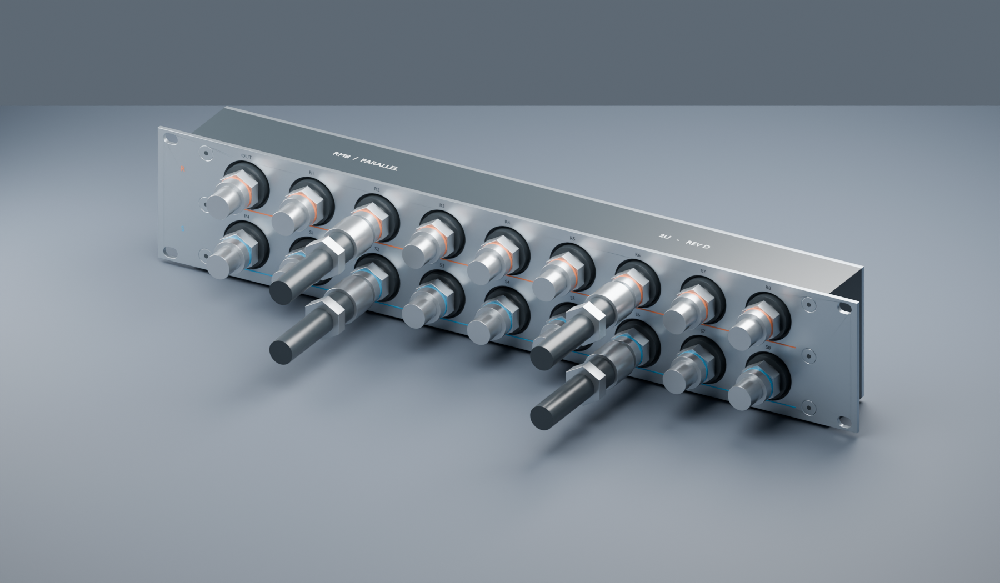

# RM8-2U rack coolant manifold

Initial design, revision D: eight parallel circuits, all connections on one face, black Delrin body and a flat stainless steel rack faceplate. Each G1/4 female port is inside an integral cylindrical POM boss, standing 3 mm proud of the steel. The 2U format provides space to operate QD3 release rings without crowding adjacent fittings.



| Parameter | Initial model |
|---|---|
| Bare rack envelope | 482.6 × 49 × 87 mm (width × depth × height) |
| Ports |18 × G1/4 female BSPP, machined into Delrin |
| Circuits |8 paired branches plus main inlet/outlet |
| Port pitch |45 mm horizontal /40 mm vertical |
| Reference pull-ring gaps |21.3 mm horizontal /16.3 mm vertical |
| Internal paths |One uninterrupted supply gallery and one uninterrupted return gallery |
| Manufacture |Rear-pocket milling, drilled/tapped front ports, sealed stainless rear cover, flat stainless faceplate |

The dimensions of EK's reference manifold are 326 × 57 × 36 mm; its published 57 mm height is 12.55 mm above 1U. Our model uses 2U to prioritise servicing access. See [design reasoning](docs/design.md) and [manufacturer sources](docs/sources.md).

## Alternative: one backing plate

[Option C](docs/backplate.md) removes the front plate and extends the rear gallery cover to rack width, combining the rack mount and gallery closure in one flat steel part. The flat POM face in Option C projects 43 mm forward of the rail surface; reference male QD tips project about 75.1 mm. All ports remain exposed. This interprets the user's bottom plate as a backing plate parallel to the rack face.

- [Compare both arrangements](output/mounting-comparison.svg).
- [Option C Blender model](output/backplate/manifold-review.blend).
- [Option C STEP assembly](output/backplate/cad/manifold-assembly.step).
- [Option C flat cut profile](output/backplate/cad/backplate-flat.dxf).
- [Option C assembled render](output/backplate/images/assembled.png).
- [Option C exploded rear mounting plate](output/backplate/images/backplate-exploded.png).

The Option B faceplate files remain below and are not replaced by this alternative.

## Review files

- [Editable Blender scene](output/manifold-review.blend) — CAD-derived body/cover/ears plus simplified QD3 and tube references.
- [Assembly STEP](output/cad/manifold-assembly.step) — three manufactured components and two seal envelopes. Individual body, cover and faceplate STEP files are alongside it.
- [Faceplate cut profile](output/cad/faceplate-flat.dxf) — flat DXF in millimetres; countersink the mounting holes separately.
- [POM body and cylindrical port bosses](output/images/pom-body.png).
- [Faceplate exploded view](output/images/faceplate-exploded.png).
- [Port seating section](output/port-seating-section.svg).
- [Dimensioned layout](output/layout.svg) — front and rear views.
- [Full-size clearance template](output/clearance-template-1to1.svg) — print 100%, calibrate against the 100 mm bar; large-format or tiled print required.
- [Rear pockets, cover removed](output/images/open-galleries.png).
- [Manufacturing notes and BOM](docs/manufacturing.md) — thread call-outs, sealing details, fasteners and DFM requirements.
- [Geometry verification](output/cad/verification.json).

This is an initial model for feedback and vendor DFM, not a pressure-rated production release. STEP thread holes are pilot bores: use the thread call-outs in the manufacturing notes. QD shapes are illustrative, and actual ring travel/hand access must be trialled. Working pressure, total flow, coolant and final seal selection remain open.

The 3 mm faceplate mounts to the rack. Its eighteen Ø32 mm windows clear Ø28 mm POM bosses; their sealing faces stand 3 mm proud of steel; eight separate M5 screws attach the body. The rear gallery cover remains independent. The bosses are 6 mm high from the plate-supporting POM face, passing through the 3 mm faceplate. No metal bending is required. A separate bottom support plate is permissible but is not needed for this mounting concept and is not included in revision D.

## Rebuild

Python 3.12 and Blender 5.2 were used. CadQuery 2.8 exports the STEP solids; Blender renders tessellations of those same solids. Millimetres throughout.

```sh
python3 -m venv .venv
.venv/bin/pip install -r requirements.txt
.venv/bin/python scripts/build_cad.py
.venv/bin/python scripts/draw_layout.py
.venv/bin/python scripts/export_faceplate_dxf.py
/Applications/Blender.app/Contents/MacOS/Blender --background --python scripts/render_blender.py
```

Parameters are in `cad/parameters.json`. The source defines the current faceplate/bolt pattern explicitly; changing circuit count or major dimensions also requires reviewing those patterns and the manufacturing documentation. It is not an automatically qualified product configurator.

To regenerate the alternative, use the same source with the mounting option:

```sh
.venv/bin/python scripts/build_cad.py --mounting backplate
.venv/bin/python scripts/export_faceplate_dxf.py --mounting backplate
/Applications/Blender.app/Contents/MacOS/Blender --background --python scripts/render_blender.py -- --mounting backplate
```

The default commands generate Option B; the flag writes Option C under `output/backplate/`.
