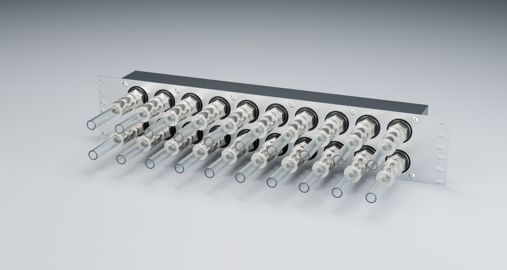

# Rack coolant manifold and SuperNova mount

The current set comprises **three custom parts**: the Revision **P** POM manifold body, its matching **P** stainless rack faceplate, and the operator-approved **R6** SuperNova radiator/fan plate. Dimensions are in millimetres. Start with the [three-part recap](docs/three-part-recap.md).

| Part | Current design | Files and status |
|---|---|---|
| Manifold body P | Black unfilled POM-C or POM-H; 410 × 87 × 40 main body, 3 mm bosses; ten front pairs at 40 × 40 pitch, four side ports; two independent long bores | [Body STEP](output/long-bore-P/cad/body.step), [P review drawing](output/pdf/manifold-revision-P.pdf). Dedicated P manufacturing issue still to be prepared. |
| Manifold faceplate P | Flat 304 stainless, 482.6 × 87 × 2; twelve plain M4 clearance holes, twelve optional rack slots | [Plate STEP](output/long-bore-P/cad/faceplate.step), [cut DXF](output/long-bore-P/cad/faceplate-flat.dxf). Use only with the matching P body and M4 ×16 button-head hardware. |
| Radiator plate R6 | Flat 304 stainless, 482.6 × 444.5 × 2; four NF-A20 positions, plain fan holes, forty optional rack slots, 10 × 2 cable notch | [R6-M01 part ZIP](output/submission/R6-M01/SN1260-R6-M01-PLATE.zip), [production guide](docs/jlc-submission-R6-M01.md). Prepared for quotation/manufacturing review; no supplier submission made. |

The manifold provides parallel supply and return without internal grouping. Every coolant port is direct G1/4 female. Side-fed infrastructure leaves all ten front pairs available for loads; using one front pair for infrastructure leaves nine. There is no rear cover or large gallery seal. Side plugs retain their own face seals.

The operator has accepted the current Koolance QD3-MTG4 / QD3-FT10X13 studio rendition and coupled placement. Rack installation includes sufficient front service space. These are mechanical design and review files, not pressure-rated or complete-assembly load-rated releases.

## Project guide

- [Design and interfaces](docs/design.md) — P manifold geometry, topology and rack/service clearances.
- [Manifold P detail and checks](docs/revision-P-plain-bore-faceplate.md) · [current renders and Blender scenes](docs/product-views.md) · [official fitting integration](docs/koolance-qd3-studio-integration.md).
- [Radiator R6 assembly](docs/radiator-rack-plate.md) · [load budget and analysis basis](docs/radiator-load-assessment.md) · [X-Splitter fit](docs/radiator-x-splitter-fit.md).
- [Manufacturing status and remaining work](docs/manufacturing.md) — includes the missing P supplier issue; O-M02 ZIPs describe superseded parts.
- [POM and coolant assessment](docs/pom-coolant-assessment.md) · [Blitz overrun qualification plan](docs/blitz-overrun-qualification.md) · [D5 pressure basis](docs/d5-pressure.md).
- [StarTech25U installation and composite scene](docs/context-25U.md) — P/R6, eight GPUs, host, eight fans and provisional pump/reservoir support.
- [Source index](docs/sources.md) · [rebuild commands](docs/rebuild.md) · [revision register and archive](docs/iterations.md) · [output directory guide](output/README.md).

## Working on the project

Use `cad/iterations/P-long-bore.json` for the manifold and `cad/radiator/R6.json` / `cad/manufacturing/R6-M01.json` for the radiator. Follow [AGENTS.md](AGENTS.md) and the explicit revision flags in the rebuild guide: several older scripts intentionally default to historical designs. Thread cylinders in STEP are tapping pilots; the relevant drawing supplies the machining call-outs.

Superseded writeups are in [docs/archive](docs/archive/README.md). Historical CAD, renders and calculation evidence retain their revision-specific locations; their presence does not make them current. Git history preserves the earlier project entry points and design decisions.
