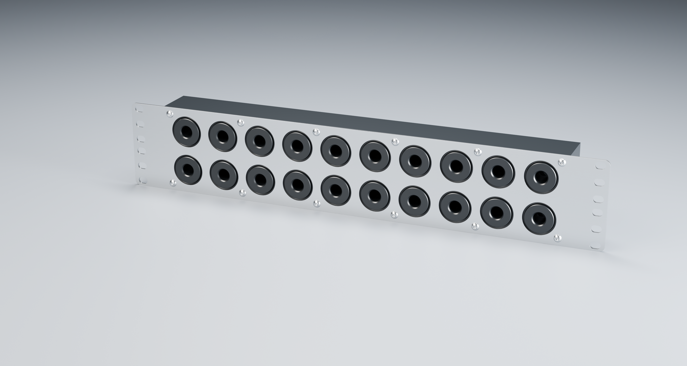
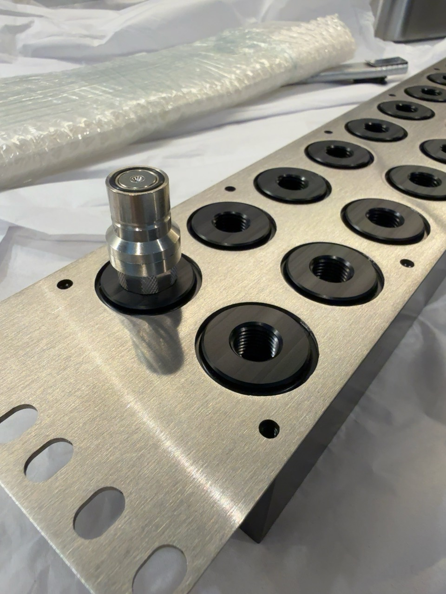
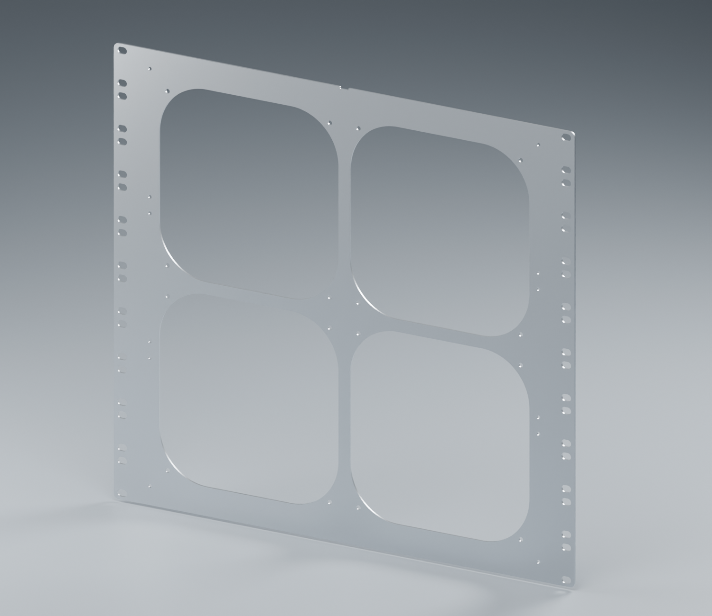

# Rack coolant manifold and Supernova mount

A ten-pair coolant manifold and a radiator mounting plate for 19-inch open racks. The manifold routes parallel coolant flow through two long galleries in a single machined POM body. A flat stainless faceplate mounts it to the rack; fittings seal directly against raised POM bosses. A separate 10U plate mounts an Alphacool Supernova radiator and four Noctua NF-A20 fans.

*Current Q manifold assembly. Rendered materials are illustrative; the steel fabrication specification is raw sheet finish.*

**To manufacture the same three parts, start with [Order these parts from JLC](docs/order-from-jlc.md).** It lists the exact ZIPs and supplier settings. No CAD software or regeneration is needed to use the existing fabrication pack.

## Canonical fabrication files

Current set: **Q-M04 POM body + Q-M03 faceplate + R7-M01 radiator plate**. These are the issues used for the delivered first articles. Geometry revisions Q/R7 and manufacturing issue suffixes are distinct; an older Q-M01 body is not the current Q-M04 body.

| Part | Main dimensions in mm | Download for manufacture | Technical drawing |
|---|---|---|---|
| Q-M04 manifold body | 410 × 87 × 40 slab; 3 mm bosses | [Body ZIP](output/submission/current-three-parts/RM10-Q-M04-BODY.zip) | [Body PDF](output/pdf/RM10-Q-M04-BODY.pdf) |
| Q-M03 manifold faceplate | 482.6 × 87 × 2; 2U allocation | [Faceplate ZIP](output/submission/current-three-parts/RM10-Q-M03-FACEPLATE.zip) | [Faceplate PDF](output/pdf/RM10-Q-M03-FACEPLATE.pdf) |
| R7-M01 radiator plate | 482.6 × 444.5 × 2; 10U | [Radiator ZIP](output/submission/current-three-parts/SN1260-R7-M01-PLATE.zip) | [Radiator PDF](output/pdf/SN1260-R7-M01-PLATE.pdf) |

Each ZIP contains one part's STEP and fabrication PDF; steel ZIPs also contain a DXF. **STEP holes are tapping pilots: the accompanying PDF defines the finished G1/4 and M4 threads.** Assembly models, STL meshes and renders are not substitutes for the fabrication bundles.

For tools and AI readers, [cad/current-release.json](cad/current-release.json) lists the canonical issues, paths and SHA-256 hashes. [The output guide](output/README.md) explains historical and shared dependencies. Earlier versions remain in their original locations.

## What the manifold provides

- Twenty front G1/4 female ports: ten pairs at 40 × 40 mm centres. Four side and four rear ports provide alternative infrastructure connections.
- Two continuous common galleries, with no internal grouping. Feeding from the sides or rear leaves all ten front pairs available for loads.
- One unfilled black POM-C or POM-H body. There is no sealed cover joint; fitted plugs and couplings provide their own face seals.
- Twenty raised bosses with chamfered lips and rounded roots, projecting nominally 1 mm beyond the 2 mm steel plate.
- Twelve plain M4 faceplate fixing holes and optional rack slots. Assembly uses M4×10 button-head screws; no countersinks.

*Studio presentation uses official, unscaled Koolance QD3-MTG4 and QD3-FT10X13 reference models. Coupled registration is described in the [fitting notes](docs/koolance-qd3-studio-integration.md).*

## Hardware received

The manifold and faceplate have been manufactured. On 5 October 2026, the operator verified their dimensions, the POM M4 holes and G1/4 ports, smooth QD3 engagement and mounting without perceptible plate flex. The radiator plate is delivered but operator-unverified, pending a spare Supernova. No leak-test result has yet been reported.

*Operator photograph of the first article, during fit checking.*

The first parts were made by **JLCCNC**. Observations about POM holding marks and slight steel-edge sharpness concern that delivered batch; they are documented in the [JLCCNC first-article report](docs/jlc-first-article.md), alongside the accepted fit and remaining finish question. They are not a general judgement of raw stainless steel or other manufacturers.

## Radiator plate and rack context

The flat plate has four fan apertures, plain fan fixing holes for screws and nuts, radiator-frame fixing holes, optional rack slots and a rounded cable notch. The illustrated 25U layout places the radiator below the host, the manifold above it and eight water-cooled GPUs higher in the rack. [Assembly guidance](docs/radiator-rack-plate.md) and the [rack scene](docs/context-25U.md) explain the arrangement.

These are prototype designs with physical manifold fit verification, not qualified pressure, transport or long-term creep ratings. Side-elbow clearance to rack hardware remains a separate actual-hardware check. Detailed assumptions and limits are in [manufacturing status](docs/manufacturing.md) and the linked engineering studies.

## Explore or reproduce the project

| Goal | Start here |
|---|---|
| Order the same parts | [JLC repeat-order guide](docs/order-from-jlc.md) |
| Understand dimensions and materials | [Three-part recap](docs/three-part-recap.md) |
| Assemble the manifold | [Assembly guide](docs/assembly-Q.md) |
| Find engineering evidence and history | [Documentation index](docs/README.md) |
| Rebuild CAD, PDFs or Blender scenes | [Rebuild guide](docs/rebuild.md) |
| Understand `tmp/` and local caches | [Temporary-work guide](docs/temporary-work.md) |
| Read the project retrospective | [Astra's commentary](docs/astra-commentary.md) |
| Contribute changes | [Working rules](AGENTS.md) |

The repository retains substantial CAD, Blender and analysis history. The [publication review](docs/publication-review.md) records repository size, retained supplier records, third-party assets and portability limits. **The project licence is not yet selected**; see [licensing and provenance](LICENSING.md). No blanket reuse grant is implied for manufacturer reference models.
