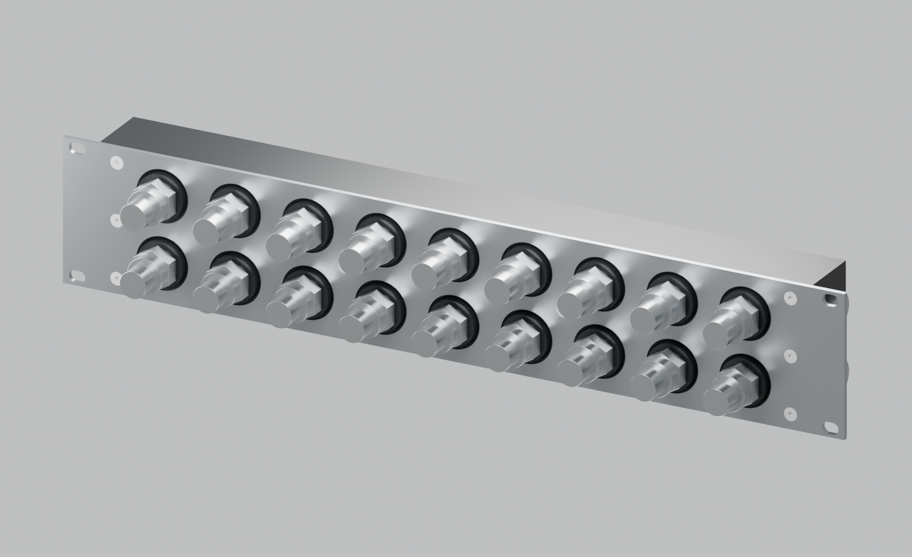
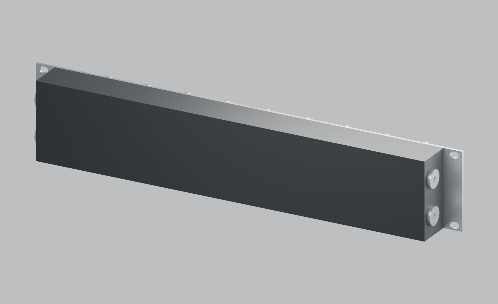
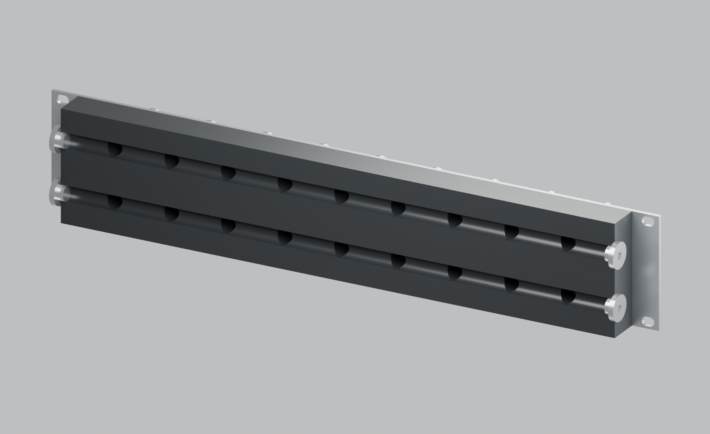

# Revision H — long-bore galleries with plugged ends

> **Historical reference — superseded.** This page describes an earlier design or assessment. Its recommendations and “current” labels apply only to that snapshot. Use the [current project guide](../../README.md) and [three-part recap](../three-part-recap.md) for P / R6.


This is a **separate iteration** of the eight-circuit, 2U manifold. Revision G remains preserved under Git tag `revision-g-rear-cover` at commit `8ebd431`, with its original files intact. H retains the front rack faceplate, raised POM port bosses and eighteen front connections, replacing the rear pockets/cover with two longitudinal bores through a single POM body.

There are **two G1/4 female ports on each end: four side ports total**. One on each side opens into the supply gallery; the other opens into the return gallery. All four initially receive sealing plugs. There are no internal plugs, partitions or grouped circuits. The existing front IN/OUT pair remains the initial loop connection; the extra end ports are plugged access/service ports.





## Files

- [Assembly STEP](../../output/long-bore-H/cad/manifold-assembly.step): POM body, front faceplate and four **reference** plug envelopes.
- [POM body STEP](../../output/long-bore-H/cad/body.step).
- [Front faceplate STEP](../../output/long-bore-H/cad/faceplate.step) and [cut DXF](../../output/long-bore-H/cad/faceplate-flat.dxf). Geometrically identical to revision G; its front plate drawing still applies.
- [Editable unmarked Blender assembly](../../output/long-bore-H/product-views/assembled-unmarked.blend).
- [Parameters](../../cad/iterations/H-long-bore.json) and [geometric checks](../../output/long-bore-H/cad/verification.json).
- [Supply fluid network](../../output/long-bore-H/cad/fluid-network-1.step) and [return fluid network](../../output/long-bore-H/cad/fluid-network-2.step): diagnostic void solids, not parts to manufacture.

The STEP uses pilot cylinders instead of thread helices. Supply this document with the CAD; do not manufacture the port bores as untapped holes. The plugs in the assembly are illustrative envelopes with clearance-sized shanks, not supplier production models or a geometrical seal simulation.

## Gallery construction and port details

| Feature | Revision H |
|---|---|
| Body | Black unfilled Delrin/POM-H, 440 × 40 × 87 mm, plus existing 6 mm front bosses |
| Front faceplate | Existing flat 482.6 × 87 × 3 mm stainless rack plate |
| Bare rack envelope | 482.6 wide × 46 deep × 87 high; reference end plugs stay inside rack width |
| Longitudinal galleries | 2 × Ø11.8 nominal through the full 440 mm body width |
| Gallery axes | Along X, at Y = 26; Z = 23.5 and 63.5 |
| Front ports | Existing 18 × G1/4 female; 45 horizontal / 40 vertical pitch |
| End ports | 4 × G1/4 female, at X = ±220, Y = 26, Z = 23.5 / 63.5 |
| End plug sealing land | Flat Ø22 annulus on each side face; no recess or body O-ring groove |
| End mouth lead-in | Ø13.8 mouth to Ø11.8 pilot, 1 mm axial depth |
| End usable thread | Minimum 8 mm full G1/4 thread, excluding lead-in; agree run-out and gauging |
| Nominal wall in front of gallery | 20.1 mm behind the base front plane |
| Nominal rear wall | 8.1 mm, continuous POM |
| Nominal web between galleries | 28.2 mm |
| Mounting | 8 × A4 M4 × 12 DIN 7991 front screws; specified DIN 965 Z alternative accepted |
| Rear plate / rear fasteners / large seals | None |

Coordinates follow G: X along rack width, Y from the front plate-supporting POM plane towards the rear, Z up from the body bottom. Front boss ends remain at Y = −6, 3 mm proud of the steel. The rear body surface is at Y = 40. There are no rear holes or grooves.

The front Ø11.8 drilled cylinders now extend from the raised ends to Y = 26, reaching the longitudinal gallery centreline. The CAD includes nominal 118° drill points extending to Y = 29.545. Preserve at least the original 8 mm full usable front G1/4 thread. Agree drill point/tooling and tapping run-out with the vendor, keeping the rear wall intact. Deburr every cross-hole intersection and flush all chips through the open end bores before fitting plugs.

The gallery diameter is deliberately compatible with the initial G1/4 tap-drill representation. A Ø16 gallery bored straight through the ends would remove the material needed for direct G1/4 threads. Retaining a much larger gallery would need a different end closure, a reducing insert, or specialised internal enlargement; those features are not included in H. Supplier selection of tapping tools and finished ISO 228-1 gauging takes precedence over treating the nominal pilot diameter as a finished thread tolerance.

## Plug and seal specification

Use four G1/4 BSPP male plugs with suitable integral **EPDM face seals**, initially nickel-plated brass to match the conventional loop material set. A suitable family to investigate is Koolance SCR-CP003PG-5P: the manufacturer's [plug listing](https://koolance.com/nozzle-socket-plug-5-pack) describes nickel-plated brass plugs supplied with O-rings. No purchase has been made.

The initial CAD envelope is **Ø20 head × 4 mm projection, 5 mm thread length and 5 mm hex drive**. These are design allowances, not asserted Koolance dimensions. Confirm actual plug dimensions, seal contact band, compression, installation torque and material compatibility before release. The Ø22 flat land must fully support the compressed seal; a correctly seated plug must not bottom on thread run-out. Reference plug ends remain 28.42 mm clear of the nearest front thread-major envelope along X. The external plug heads extend to X = ±224, giving 448 mm across the plugged body. Check the actual rack rail/channel shape and lateral hex-key access at Y = 26; the CAD includes the faceplate but not the rack rails. Install/service plugs with the manifold removed if the installed rails obstruct access.

H removes **both large gallery O-rings and their machined grooves**, not all elastomer seals from the product. Each end plug still seals against its POM face with a small supplied seal, and the front QD fittings retain their own seals. Parallel G1/4 threads are not themselves the liquid seal. The [Koolance equipment manual](https://koolance.com/files/products/manuals/manual_exc-450_d100eng.pdf) likewise identifies the O-ring as the seal for its parallel-thread fittings. Do not assume bare threads or extra tightening can replace it.

## Manufacturing assessment

The bore aspect ratio is **37.29:1** for one full-length drilling pass. Opposed drilling with a nominal 4 mm overlap is **222 mm from each end, or 18.81:1**. The intended result is one continuous bore in each row; the opposed setup introduces no internal grouping.

This is deep-hole work, not automatically an easier ordinary CNC operation. [Xometry's design guidance](https://www.xometry.com/resources/blog/advanced-tips-for-cnc-designs-and-drawings-webinar/) recommends keeping routine drilled holes below approximately 10 diameters of depth and explains that longer holes can require specialised tools or machines. Manual vendor DFM must establish whether an available shop can drill this POM length, remove chips and control heat/wander. JLC or any other vendor's acceptance has not been established. Gun drilling or a suitable long-drill process may be appropriate; the vendor should select the process.

For opposed drilling, agree registration, overlap, permissible bore mismatch and an inspection method. CAD shows a perfectly straight bore and does not simulate drill wander or an offset meeting point. Check wall retention, full connection of all front branches and an unobstructed meeting region. This is a potential cost/quality driver despite the reduced part count.

Side machining adds two end setups but removes rear-pocket milling, perimeter groove machining, rear tapping and rear-cover fabrication. Existing front plate and boss machining remain. Finish the side sealing lands to Ra ≤1.6 µm and agree local flatness/perpendicularity with the plug supplier. Retain the existing front thread, M4 and faceplate specifications. General external dimensional targets remain ±0.15 mm; use ±0.10 for front port/mount positions. Long-bore diameter, straightness, axis drift and end registration need a separately agreed deep-drilling tolerance rather than an unsupported blanket ±0.10 over 440 mm.

## Comparison with preserved G

| Item | G: rear-milled pockets | H: long bores |
|---|---:|---:|
| Manufactured parts | POM + front steel + rear steel | POM + front steel |
| Plate-to-POM screws | 39 M4 | 8 M4 |
| Large gallery seals | 2 | 0 |
| End closure plugs / small supplied seals | 0 | 4 / 4 |
| Local gallery cross-section | 16 × 24 = 384 mm² | Ø11.8 = 109.36 mm² |
| Bare depth including bosses | 49 mm | 46 mm |
| Rear inspection | Remove cover to expose pockets | Inspect/flush through ports and bores |
| Main manufacturing concern | Pocket/groove and cover sealing quality | Deep drilling, chip removal and bore alignment |

At the **same local gallery flow**, H has 3.51 times the mean velocity because of its smaller area. The gallery hydraulic diameter also drops from 19.2 mm to 11.8 mm. These dimensions suggest greater gallery pressure loss; they do not establish a total pressure-drop multiplier or prove adequate flow distribution. Flow reduces along a supply gallery as branches take coolant, and branch/QD restrictions also contribute. Use the actual inhibited coolant and required branch flows for the eventual hydraulic assessment.

H removes the large pressure-cover joint and its creep/preload/seal-lift concern. It retains pressure loads in the POM bores, end plug threads and seals, and front port fittings. It is neither pressure-rated nor structurally validated. The user-confirmed coolant assumption remains a formulated inhibited fluid such as Mayhems X1 or Koolance 705, with exact formulation to be selected. The dry rack plate is now the only steel plate; there is no wetted stainless rear plate.

## Internal section and other views

The following image removes the rear half of the body **only for inspection**. Those exposed semicircular tracks are sections of round bores, not open pockets in the manufactured body.



[Front](../../output/long-bore-H/product-views/03-front.png) · [Rear](../../output/long-bore-H/product-views/04-rear.png) · [Left end](../../output/long-bore-H/product-views/05-left.png) · [Right end](../../output/long-bore-H/product-views/06-right.png) · [Top](../../output/long-bore-H/product-views/07-top.png) · [Bottom](../../output/long-bore-H/product-views/08-bottom.png)

Rebuild independently:

```sh
.venv/bin/python scripts/build_long_bore.py
/Applications/Blender.app/Contents/MacOS/Blender --background --python scripts/render_product.py -- --iteration H
```
