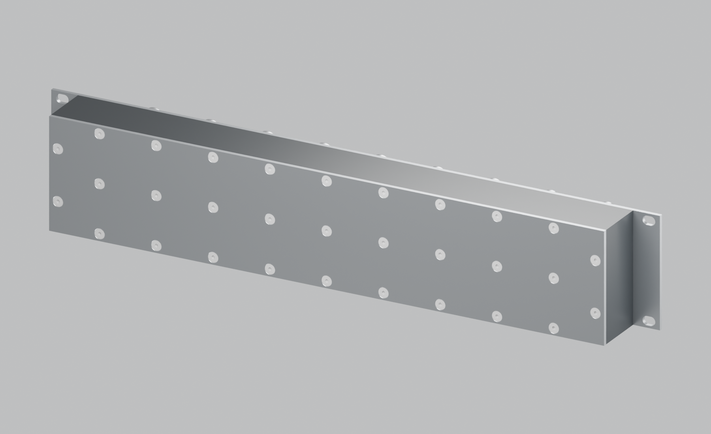
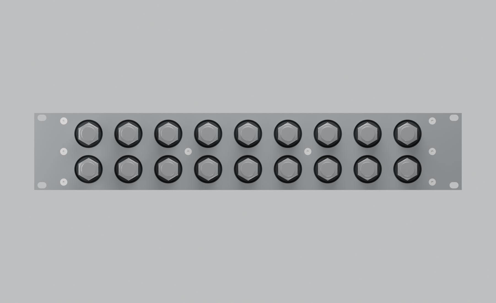
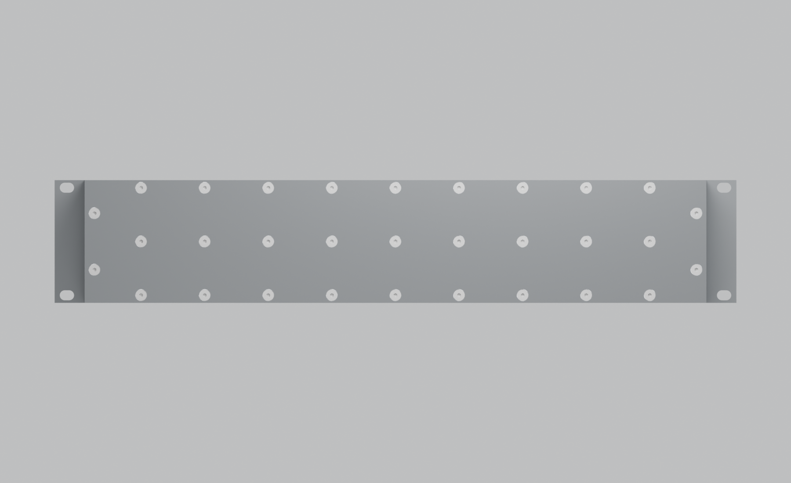
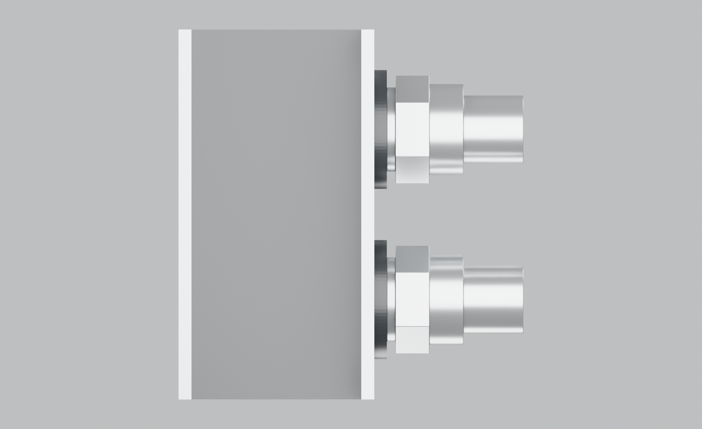
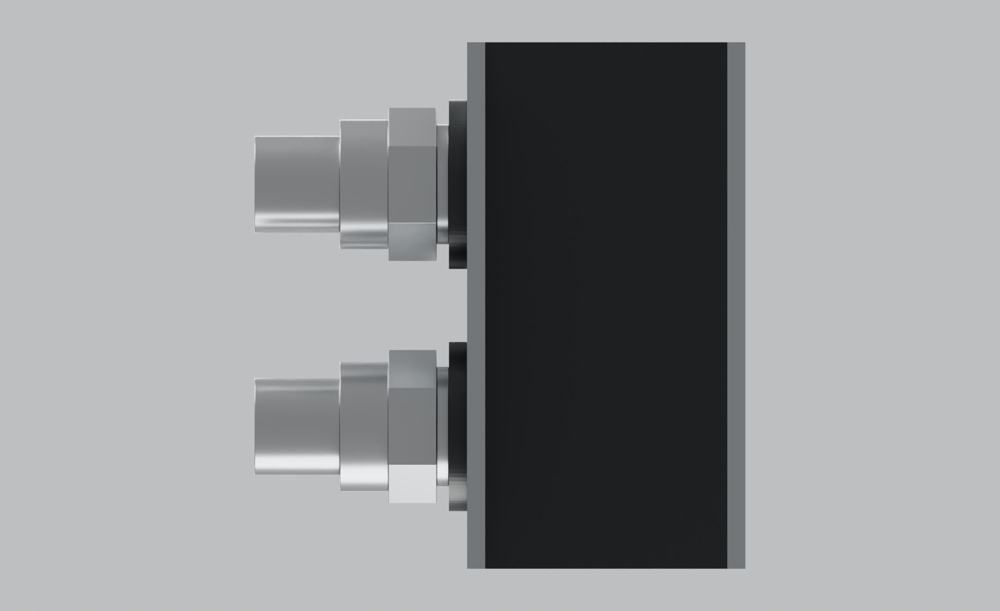
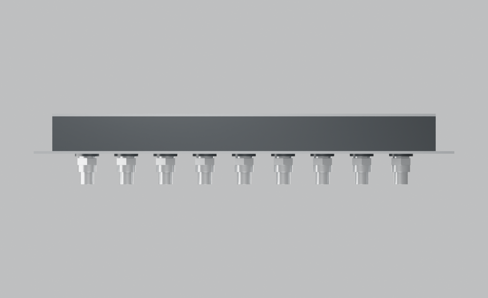
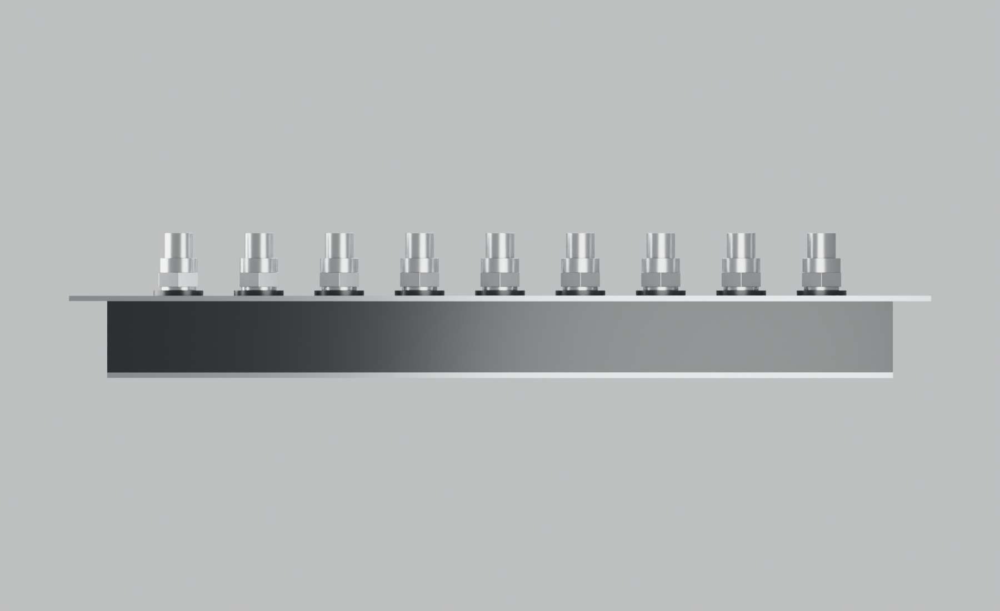

# Assembled manifold — unmarked revision G

> **Historical reference — superseded.** This page describes an earlier design or assessment. Its recommendations and “current” labels apply only to that snapshot. Use the [current project guide](../../README.md) and [three-part recap](../three-part-recap.md) for P / R6.

Selected Option B, assembled with the front rack faceplate, separate rear sealing plate and 39 M4 socket countersunk screws. All eight views show eighteen simplified manifold-side male QD3 references. The POM body and steel plates come from the CAD tessellations; the bought-in fittings and screws are illustrative. The scene has no surface text, colour bands, identification lines or other markings.

[Editable Blender assembly with eight named cameras](../../output/product-views/assembled-unmarked.blend) · [Render manifest](../../output/product-views/render-manifest.json)

## Front three-quarter

## Rear three-quarter

## Front

## Rear

## Left

## Right

## Top

## Bottom

Regenerate from the selected CAD with `scripts/build_cad.py`, then run Blender in background mode with `--python scripts/render_product.py`. Render dimensions are 1800 × 1100 pixels. The clean product scene is separate from the earlier annotated technical review scene. Rendering does not change the manufactured geometry or establish hardware fit, pressure or structural performance.
