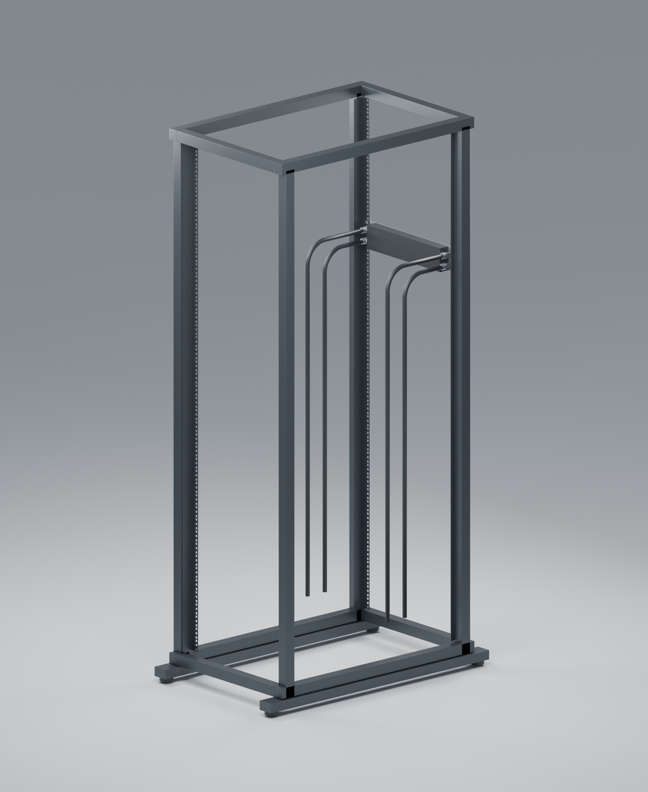
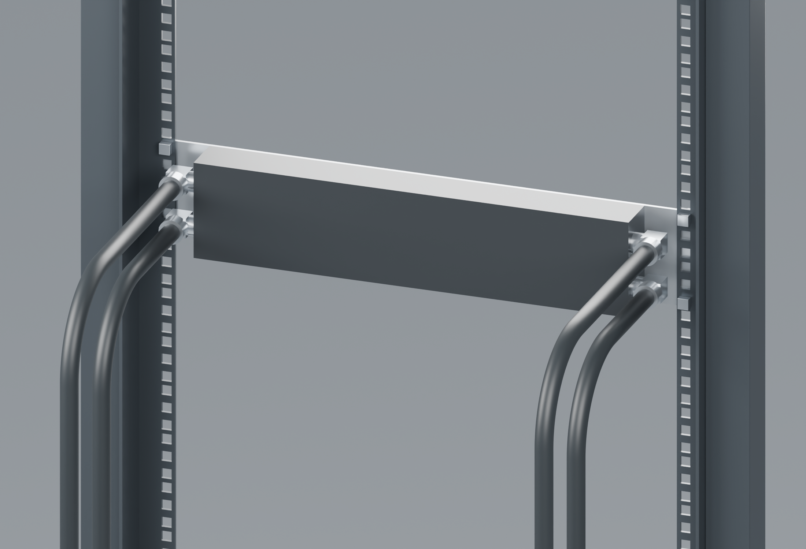

# Revision I in a 42U open-frame rack

> **Historical reference — superseded.** This page describes an earlier design or assessment. Its recommendations and “current” labels apply only to that snapshot. Use the [current project guide](../../README.md) and [three-part recap](../three-part-recap.md) for P / R6.


Revision I is shown installed at U31–U32 of an illustrative four-post 42U rack, viewed from the rear at an angle. All four side ports carry rearward-facing 90° rotary elbow and 10/16 compression fitting references, with four black tubes installed. Front QDs and the front rack faceplate remain in place; the manifold design is unchanged.





[Editable Blender scene](../../output/long-bore-I/rack-installation/revision-I-in-42U-rack.blend) · [Scene dimensions and assumptions](../../output/long-bore-I/rack-installation/scene-notes.json)

The rack has 42 × 44.45 mm of mounting height, front and rear mounting planes 800 mm apart, and an assumed 450 mm equipment opening. Its perforated mounting rails use the existing design's 465.1 mm horizontal fixing centres. The rack is an illustrative assembly rather than a specific vendor model. The manifold is fixed through its four rack slots, and its six M4 body-retention screws remain fitted.

The fitting references reuse the BP-90R/Barrow envelopes from the [width comparison](width-variants.md). The four tubes are modelled with an actual 10 mm bore and 16 mm outside diameter, with 80 mm centreline bends and separate vertical lanes at 220 and 300 mm behind the front mounting plane. Their tails stop near the rack bottom; downstream equipment is omitted, so this is a routing illustration rather than a completed coolant circuit. Both gallery ends are populated as requested, without assigning pumps or flow directions.

The nominal side-fitting envelope remains 447.6 mm wide. The illustrative rack leaves 1.2 mm clearance on each side at its assumed opening; exact rail profiles and hardware tolerances still determine actual fit. The 80 mm tube bends are a visual routing choice, not a verified minimum bend radius for a selected tube product. This scene does not establish structural, pressure or hydraulic performance.

Rebuild after generating Revision I meshes and the preserved product scene:

```sh
/Applications/Blender.app/Contents/MacOS/Blender --background --python scripts/render_rack_installation.py
```
