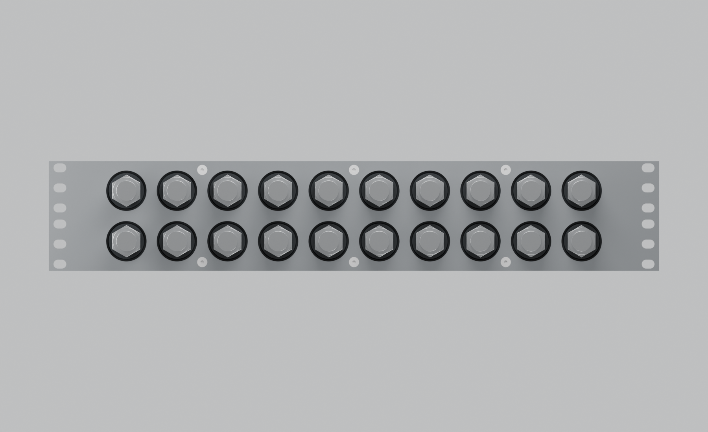
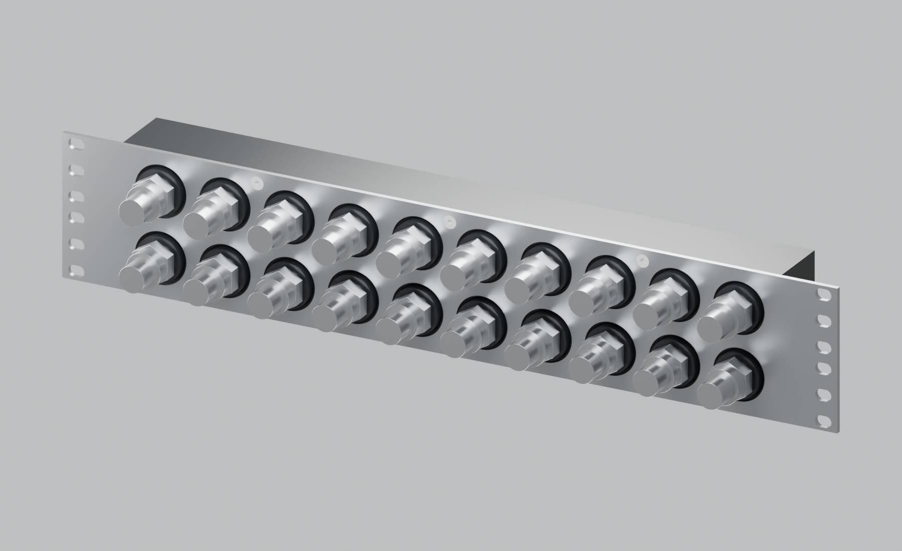
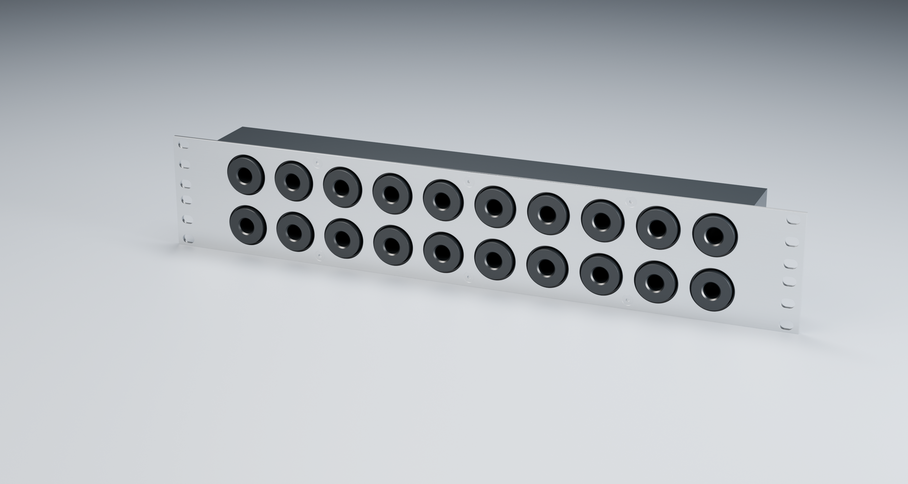
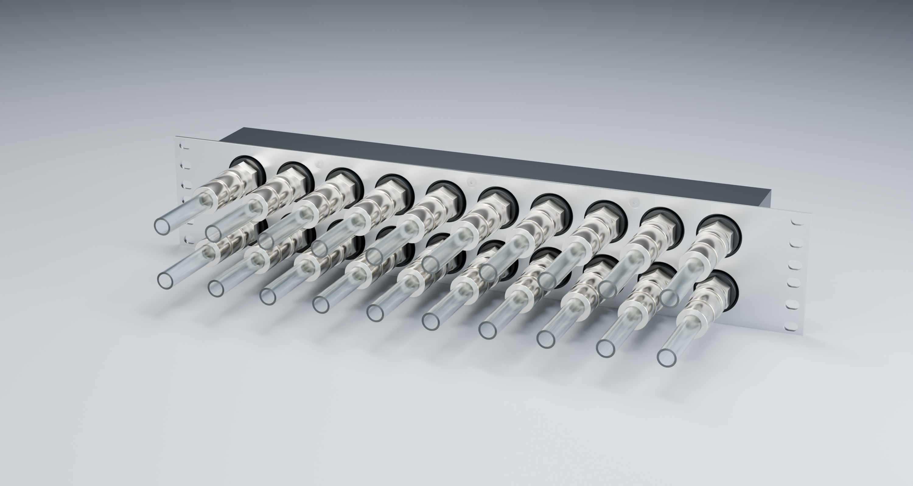

# Revision M — POM fixings moved inward

> **Historical reference — superseded.** This page describes an earlier design or assessment. Its recommendations and “current” labels apply only to that snapshot. Use the [current project guide](../../README.md) and [three-part recap](../three-part-recap.md) for P / R6.

The six faceplate-to-POM M4 fixings now form three columns at **X = −120, 0 and +120 mm**, each at **Z = 7 and 80 mm**. From the front, these sit between pairs **2–3**, **5–6**, and **8–9**. The outer four screws have moved inward by one 40 mm port pitch; the centre two remain in place.

Both the countersunk steel holes and matching blind POM holes have moved. The design retains six optional rack slots per side, ten front pairs at 40 × 40 mm pitch, the 410 mm POM body, and the existing galleries, bosses and side ports. Screws remain A4 M4 × 12 DIN 7991 with the specified DIN 965 Z alternative. Product surfaces remain unmarked.

- [Editable Blender assembly](../../output/long-bore-M/product-views/assembled-unmarked.blend).
- [Assembly STEP](../../output/long-bore-M/cad/manifold-assembly.step), [body STEP](../../output/long-bore-M/cad/body.step), [faceplate STEP](../../output/long-bore-M/cad/faceplate.step), [faceplate cut DXF](../../output/long-bore-M/cad/faceplate-flat.dxf).
- [Parameters](../../cad/iterations/M-long-bore.json), [geometry checks](../../output/long-bore-M/cad/verification.json).

The previous L outputs remain preserved, with its original design snapshot tagged `revision-l-six-rack-positions` at `d229d19`. Rebuild using `scripts/build_long_bore.py --iteration M`, then `scripts/render_product.py --iteration M` through Blender's script arguments.

## Photographic studio views

Two additional front three-quarter presentations use the same Revision M manifold geometry, with satin black POM, brushed stainless steel, nickel fitting finishes and softbox lighting. There are no surface markings.

The bare version has all twenty front ports and all four side ports unpopulated; the six M4 body screws remain installed. The connected version has twenty approximated male/female QD3 connections, twenty short translucent tube tails with **10 mm ID and 13 mm OD**, and four side plugs. The female coupling and compression-tail envelopes are illustrative; an exact 10/13 female fitting SKU has not been selected. The tubing is shown as open-ended samples, not a completed loop. Thread bores retain the simplified CAD representation.

- [Editable bare assembly](../../output/long-bore-M/photorealistic/01-bare-ports.blend).
- [Editable connected assembly](../../output/long-bore-M/photorealistic/02-qd3-translucent-tubes.blend).
- [Render settings and scope](../../output/long-bore-M/photorealistic/render-notes.json).

Regenerate with Blender: `blender -b --python scripts/render_photoreal_product.py`. Add `-- --preview` for reduced-resolution previews, or `-- --variant bare|connected` for one presentation. Physically based materials are visual approximations, not measured optical properties. The earlier Revision M scenes and CAD exports are preserved.
