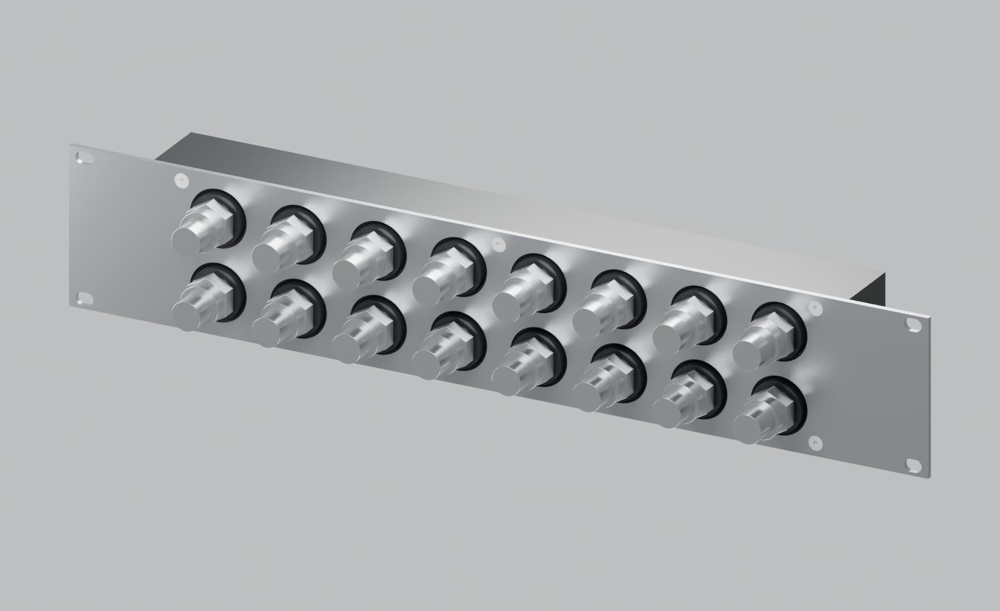
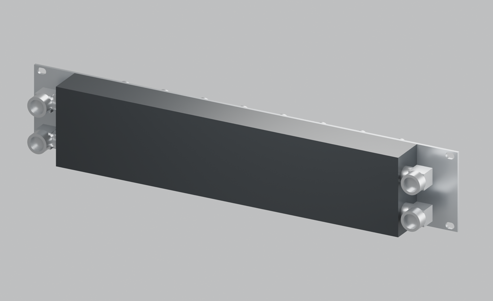
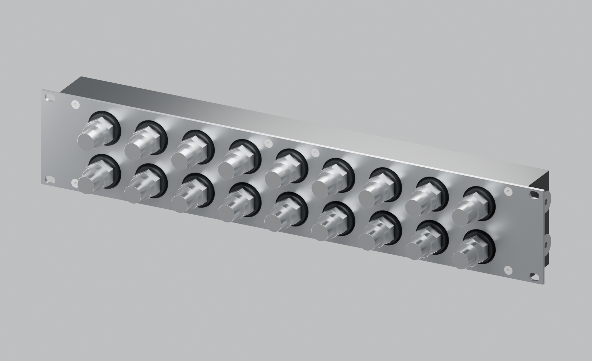
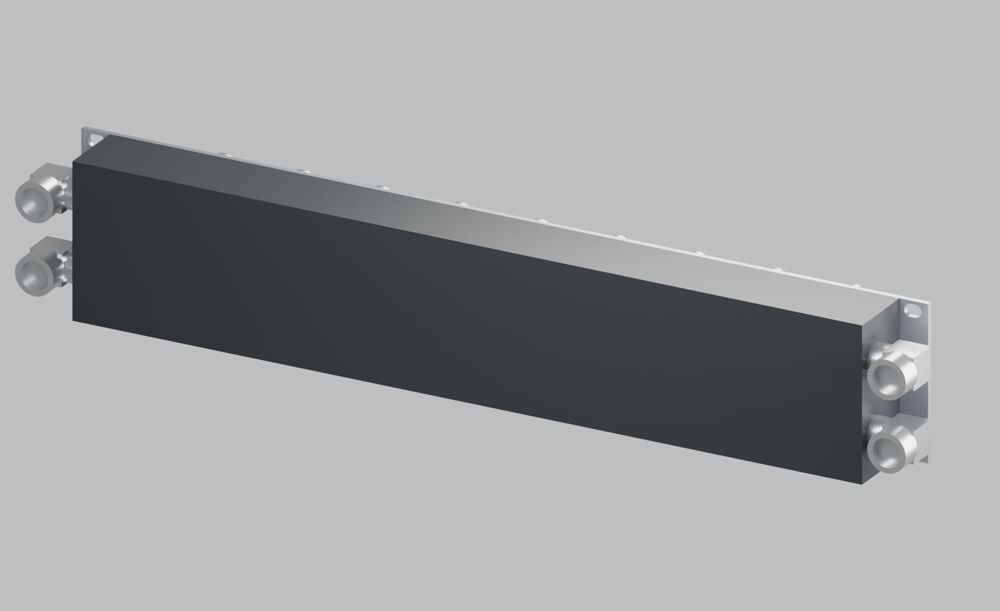
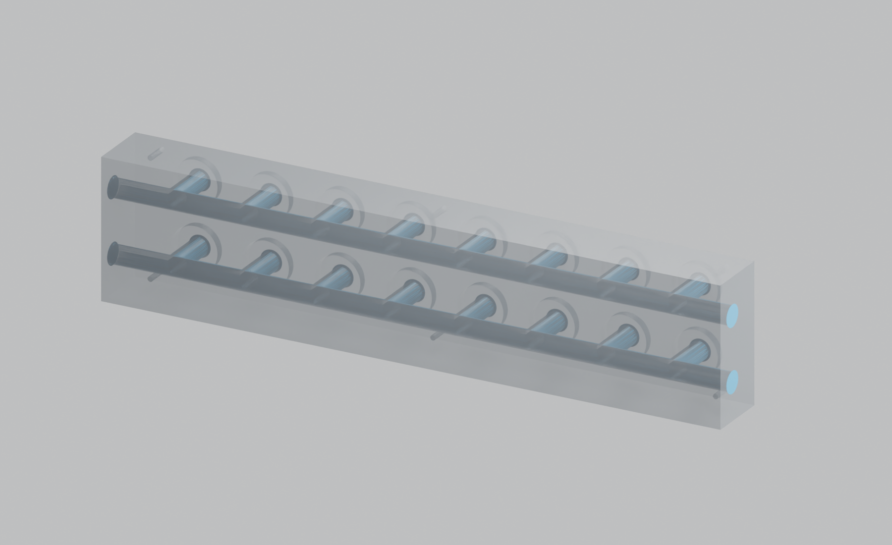
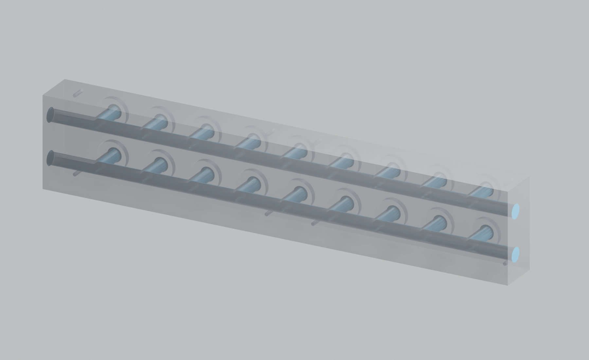

# Long-bore width variants — I and J

> **Historical reference — superseded.** This page describes an earlier design or assessment. Its recommendations and “current” labels apply only to that snapshot. Use the [current project guide](../../README.md) and [three-part recap](../three-part-recap.md) for P / R6.


Both variants preserve the front rack faceplate, two uninterrupted Ø11.8 galleries, raised G1/4 front ports and **four reusable G1/4 end ports**. Revision I has a **390 mm POM body with eight front-facing pairs**; revision J has a **450 mm POM body with nine front-facing pairs**. Pair counts include every front pair, as confirmed by the user. Neither design has a rear plate, rear fasteners, large gallery seals or internal grouping.

Supply and return can enter through two end ports, freeing **all eight or nine front pairs for systems**. The unused two end ports can remain plugged. With all four end ports plugged, the builder must dedicate one front pair to infrastructure, leaving seven or eight system pairs. The supplied plugged renders show the initial closure arrangement; the elbow renders show the optional end hardware envelope. The ports remain serviceable threaded ports, not permanently bonded closures.

Revision G and the initial 440 mm long-bore revision H remain preserved at tags `revision-g-rear-cover` and `revision-h-long-bore`; their parameters and generated outputs are unchanged.

| Feature | I — side-clearance variant | J — maximum-body variant |
|---|---:|---:|
| POM body width × depth × height | 390 × 40 × 87 mm | 450 × 40 × 87 mm |
| Front-facing pairs / ports | 8 / 16 | 9 / 18 |
| System pairs with end-fed infrastructure | 8 | 9 |
| System pairs with a front infrastructure pair | 7 | 8 |
| Front port pitch | 45 horizontal / 40 vertical | 45 horizontal / 40 vertical |
| Front port X positions | −157.5 to +157.5, at 45 | −180 to +180, at 45 |
| Front M4 screws | 6, two rows | 8, two rows |
| M4 centre X positions, each at Z = 7 / 80 | −178, 0, +178 | −208, −22.5, +22.5, +208 |
| Side allowance within assumed 450 opening | 30 mm each side | 0 mm |
| Width with 4 mm plug heads | 398 mm | 458 mm |
| Width with drawing-derived 28.8 mm fitting projection | 447.6 mm | 507.6 mm |
| Width with full 30 mm allowances | 450 mm | 510 mm |
| Nominal fitted margin within 450 opening | 1.2 mm per side | Exceeds opening by 28.8 mm per side |
| Opposed drill reach, including 4 mm meeting overlap | 197 mm / 16.69D | 227 mm / 19.24D |

**Both final variants retain 45 mm horizontal pitch**, with the existing 21.3 mm nominal horizontal and 16.3 mm vertical gaps between Ø23.7 QD3 pull-ring reference envelopes. Actual release-ring travel and hand access still require a physical trial.

## Revision I — 390 mm body, eight pairs





- [Assembly STEP](../../output/long-bore-I/cad/manifold-assembly.step), [body STEP](../../output/long-bore-I/cad/body.step), [faceplate STEP](../../output/long-bore-I/cad/faceplate.step).
- [Front plate drawing](../../output/long-bore-I/faceplate-drawing.svg) and [cut DXF](../../output/long-bore-I/cad/faceplate-flat.dxf).
- [Side fitting clearance drawing](../../output/long-bore-I/side-clearance-drawing.svg) and [reference elbow-envelope STEP assembly](../../output/long-bore-I/cad/elbow-envelope-assembly.step).
- [Opaque assembled Blender scene](../../output/long-bore-I/product-views/assembled-unmarked.blend), [50% transparency Blender scene](../../output/long-bore-I/product-views/body-50-percent-transparent.blend).
- [Parameters](../../cad/iterations/I-long-bore.json), [geometry verification](../../output/long-bore-I/cad/verification.json), [render manifest](../../output/long-bore-I/product-views/render-manifest.json).
- Other views: [rear three-quarter](../../output/long-bore-I/product-views/02-rear-three-quarter.png), [front](../../output/long-bore-I/product-views/03-front.png), [rear](../../output/long-bore-I/product-views/04-rear.png), [left](../../output/long-bore-I/product-views/05-left.png), [right](../../output/long-bore-I/product-views/06-right.png), [top](../../output/long-bore-I/product-views/07-top.png), [bottom](../../output/long-bore-I/product-views/08-bottom.png), [cutaway](../../output/long-bore-I/product-views/09-gallery-section.png).

## Revision J — 450 mm body, nine pairs





- [Assembly STEP](../../output/long-bore-J/cad/manifold-assembly.step), [body STEP](../../output/long-bore-J/cad/body.step), [faceplate STEP](../../output/long-bore-J/cad/faceplate.step).
- [Front plate drawing](../../output/long-bore-J/faceplate-drawing.svg) and [cut DXF](../../output/long-bore-J/cad/faceplate-flat.dxf).
- [Side fitting clearance drawing](../../output/long-bore-J/side-clearance-drawing.svg) and [reference elbow-envelope STEP assembly](../../output/long-bore-J/cad/elbow-envelope-assembly.step).
- [Opaque assembled Blender scene](../../output/long-bore-J/product-views/assembled-unmarked.blend), [50% transparency Blender scene](../../output/long-bore-J/product-views/body-50-percent-transparent.blend).
- [Parameters](../../cad/iterations/J-long-bore.json), [geometry verification](../../output/long-bore-J/cad/verification.json), [render manifest](../../output/long-bore-J/product-views/render-manifest.json).
- Other views: [rear three-quarter](../../output/long-bore-J/product-views/02-rear-three-quarter.png), [front](../../output/long-bore-J/product-views/03-front.png), [rear](../../output/long-bore-J/product-views/04-rear.png), [left](../../output/long-bore-J/product-views/05-left.png), [right](../../output/long-bore-J/product-views/06-right.png), [top](../../output/long-bore-J/product-views/07-top.png), [bottom](../../output/long-bore-J/product-views/08-bottom.png), [cutaway](../../output/long-bore-J/product-views/09-gallery-section.png).

## 50% transparent POM inspection





These are body-only inspection renders from an angle. The material uses an exact **0.5 mix of Transparent and Principled surface shaders**. Blue solids highlight the actual CAD channel/port voids; they are not additional parts. Multiple surface crossings affect the visual transmission, so this is a 50% shader setting, not a claim about physical light transmission through Delrin. The real POM remains opaque. No surface text, identification lines or markings have been added.

## How the fitting allowance is derived

Dimensions come from the user-supplied [Bitspower BP-90R drawing](../references/bitspower-bp90r-user-drawing.png) and [Barrow 10/16 drawing](../references/barrow-10-16-user-drawing.png), retained with the design. The elbow stands 8.8 + 18 = **26.8 mm** above its mounting face, excluding its inserted male thread. The compression fitting is **Ø22**, projects **12.2 mm** beyond its own seating face, and has a **5 mm** inserted thread.

For a rearward-facing elbow, the compression fitting's axis is approximately 8.8 + 18/2 = **17.8 mm from the POM side**. That centre position is inferred from the symmetric outlet depiction, rather than an explicit centre-height dimension. Its Ø22 body therefore reaches 17.8 + 11 = **28.8 mm** sideways. Its 12.2 mm length projects rearwards, rather than adding to the 26.8 mm elbow height. The conservative elbow-head box and cylindrical compression envelope are shown in the reference CAD. They are not exact supplier component models; supplier tolerances, rotary offsets and seal stand-off are not provided in the supplied drawings.

Outlets in this envelope study point rearwards (+Y). The compression ends reach Y = 47.2, 7.2 mm behind the POM rear. Both side ports on each end can carry these envelopes without intersecting each other; four elbow assemblies are illustrated to show the maximum hardware configuration. A usual supply/return arrangement could instead use two elbows and leave the other two ends plugged. Tubes and their bend radii are excluded.

For I, the user-requested 30 mm allowances use all of the nominal 450 mm budget. The drawing-derived 28.8 mm projection leaves 1.2 mm nominal per side, **before** part tolerances, registration, rail variation or insertion handling. This is a nominal-fit candidate, not a guaranteed sliding fit. If the actual installation needs more margin, reduce the body further or choose fittings with smaller verified projection.

For J, even ordinary 4 mm plug heads give 458 mm across the body. The body alone uses all 450 mm of the assumed opening and has no tolerance allowance. Angled insertion, fitting installation after insertion, or use of space behind the rails may be possible in a particular rack. None is validated here: rail cross-section, adjacent equipment and the full swept insertion volume must permit both insertion and the final installed position. Rotating the panel does not resolve a collision that remains after it is straightened. The nominal elbow configuration reaches 507.6 mm across the body and must have suitable free space behind the rails to remain installed.

The **482.6 mm front rack plate stays outside the insertion-width budget**, spanning the front of the rails. Its steel outside the narrower POM is a structural part of the rack mount, not spare space that can be cut away without reconsidering the load path.

## Manufacturing scope

Each variant contains one CNC-machined POM body and one flat 3 mm stainless front rack plate. All plate-to-POM fasteners remain A4 M4 × 12 DIN 7991, accepting the specified DIN 965 Z Pozi heads. Thread pilots are Ø3.3 × 14, with minimum 10 mm full M4 thread; front steel clearance Ø4.5, countersink Ø8.0 × 90° from outside. The new top/bottom patterns replace the original three-screw corner columns. Body retention remains independent of the fittings. The six-screw I and eight-screw J arrangements are geometric proposals, not a structural load qualification.

Both POM variants are 40 mm deep and 87 mm high. Front bosses are Ø28 × 6 with R1 roots, leaving 3 mm proud of the front plate. Front G1/4 port rows remain Z = 23.5 / 63.5. Long-bore axes remain Y = 26 at those heights; side mouths are X = ±195 for I and ±225 for J. Galleries are Ø11.8 nominal, with 20.1 mm front wall, 8.1 mm rear wall and 28.2 mm separating web. Front drill cylinder depth ends at Y = 26; nominal 118° points end at Y = 29.545. Maintain 8 mm full usable G1/4 threads and use ISO 228-1 gauging; STEP pilot cylinders are not finished threads.

Side ports retain Ø22 flat sealing lands, 1 mm entry lead-in to Ø13.8 mouths, and minimum 8 mm full usable G1/4 threads excluding lead-in. Initial plug reference heads project 4 mm and threads 5 mm. The bought-in plugs/fittings supply the seals; the **POM sealing land, thread engagement, finish and absence of bottoming remain our design responsibilities**. No seal grooves or large O-rings return to the body.

Use the front-plate drawings/DXFs for each specific variant; neither is interchangeable with H's plate. Punch/laser-cut through features, machine countersinks afterwards, deburr and flatten. General dimensional targets ±0.15; front port/mount positions ±0.10; window Ø32 +0.20/0, screw clearance Ø4.5 +0.10/0, countersink Ø8 +0.10/0. Finished plate thickness 3.00 ±0.10. Side/front fitting lands Ra ≤1.6 µm, with local flatness and perpendicularity agreed for actual fittings. Deep-bore diameter, straightness and opposing-drill registration need vendor-specific agreement as described in [H's DFM review](long-bore-H.md). Neither width removes the deep-drilling issue or proves hydraulic performance. Formulated inhibited coolant remains the operating assumption.

Rebuild independently, leaving G/H outputs intact:

```sh
.venv/bin/python scripts/build_long_bore.py --iteration I
.venv/bin/python scripts/build_long_bore.py --iteration J
.venv/bin/python scripts/draw_long_bore_variants.py
/Applications/Blender.app/Contents/MacOS/Blender --background --python scripts/render_product.py -- --iteration I
/Applications/Blender.app/Contents/MacOS/Blender --background --python scripts/render_product.py -- --iteration J
```
