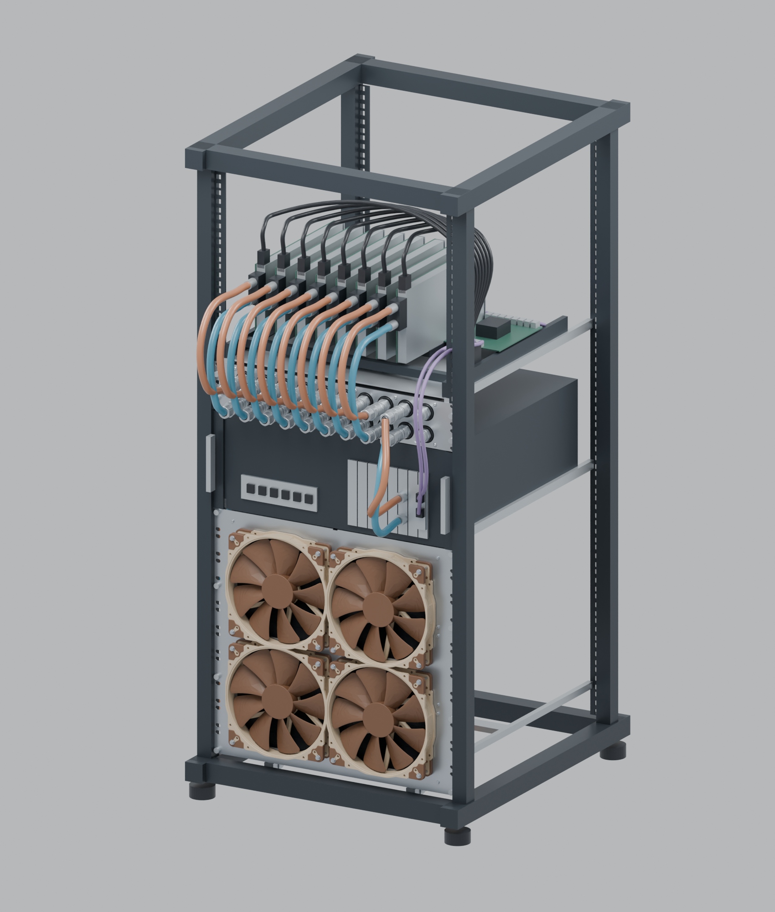

# Current 24U open-frame installation plan

The intended application is an open workstation with eight individually waterblocked GPUs on powered risers, a separate host, the P manifold and the R6-mounted SuperNova cooling assembly. It is not a proprietary integrated eight-GPU server.

| Position, top to bottom | Allocation | Current intended contents |
|---|---|---|
| U23–U24 | 2U | Service/spare space |
| U17–U22 | 6U | Eight single-slot waterblocked GPUs, retention/riser tray and PCIe switch arrangement |
| U15–U16 | 2U | Revision P parallel coolant manifold |
| U11–U14 | 4U | SilverStone RM46-502-I-style host, with I/O/PCIe brackets facing the manifold service side |
| U1–U10 | 10U | SuperNova 1260 radiator on the approved R6 fan/rack plate; front fan bank and optional opposite bank |

This preserves the intended top-to-bottom order. The existing context study assumes a 600 mm-deep open frame, 500 mm rail separation and a 440 ×456 ×176 mm host envelope. Exact rack, rails, GPU blocks and host configuration remain installation choices. The operator recalled RM46-502; the existing reference review uses RM46-502-I. These are retained study assumptions, not a newly verified equipment BOM.

GPU I/O brackets face the rack rear. Coolant terminals and 12VHPWR connections occupy the opposite, non-bracket region. Provide access and cable bend space on that side. Single-slot block thickness does not require single-slot card spacing; the original study uses 40 mm GPU centres.

## Coolant, power and data

- Front manifold pairs 1–8 serve the eight GPUs, pair 9 the host CPU/chassis loop through two bulkheads in a PCIe slot bracket, and pair 10 remains spare. This bracket is an added cooling accessory, not a factory chassis coolant interface.
- Feed the infrastructure through side ports so all front pairs remain available. The external circuit includes radiator, reservoir and pump before returning to the common supply gallery. There is no internal manifold grouping or branch balancing.
- Pump/reservoir functions are required. The current SuperNova plan can use the ULTITUBE/D5 NEXT combination behind the radiator via the existing 140 mm fan-hole plate/adapter, or a separately rack-supported pump/reservoir. Its choice and placement remain open; the [load budget](radiator-load-assessment.md) already includes the required allowance. The abandoned MO-RA side-tank arrangement is not carried forward as a current width-contained design.
- The host connection is one logical PCIe x16 link via an x16-to-two-MCIO-8i adapter and two eight-lane cables. It does not provide eight independent x16 host links.
- The requested single switch board with x16 upstream and eight electrical x16 downstream links was not identified in the earlier source review. Retain an eight-endpoint conceptual layout until exact switch/riser hardware is selected; do not claim the reviewed 100-lane c-payne board provides 144 electrical lanes.

Provide sufficient space in front of the panels for couplings, tubing and servicing. The operator accepts P's current Koolance studio placement. Radiator top/bottom fittings, local pump mounts and tubes also need space outside their bare component envelopes; 10U is the radiator plate allocation, not proof every attachment stays within it.

## Current composite scene

The refreshed scene now contains the **P** body and 2 mm plain-hole faceplate, its twelve button-head screws, official Koolance fittings, and the **R6** CAD-derived radiator plate. Nine front pairs are connected to eight GPUs and the host; the tenth remains spare. Four official NF-A20 references are installed on each side of the radiator.

[Front elevation](../output/context-24U/02-front-layout.png) · [rear overview](../output/context-24U/04-rear-cooling-assembly.png) · [pump/reservoir detail](../output/context-24U/05-pump-reservoir-detail.png) · [editable Blender scene](../output/context-24U/24U-context.blend) · [layout and source provenance](../output/context-24U/layout.json).

The radiator ports face **downwards**, using the illustrated rack's pedestal space below U1 rather than protruding into the host above. The R6 cable notch remains at the plate's top. This routing requires that base clearance in the actual installation; it is not a claim that port fittings fit inside the bare 10U panel outline.

A provisional ULTITUBE 200 / D5 NEXT envelope stands behind the rear fans on a small independent rack support. The glass is represented at nominal 200 mm length, Ø65 and 5 mm wall; pump, caps, clamps and support are illustrative. Eight A20s occupy the two 200 mm fan banks, so the scene does not invent a 140 mm bracket interface on that fan plate. The separately supported example keeps the actual pump/reservoir mounting choice open. The conservative radiator load budget remains unchanged.

Custom P/R6 geometry and official fitting/fan meshes are integration references; rack, host, GPU blocks, pump/support and cable routes remain illustrative. No complete collision, airflow, electrical or assembly-load qualification is claimed. Colours distinguish hose/data routes and do not add manifold surface markings.

Regenerate with Blender `scripts/render_context_24u.py -- --device METAL` (omit the device flag for CPU). Existing P/R6 review scenes and fitting meshes are inputs; see [rebuild.md](rebuild.md). Separate generated sketches are no longer maintained. The previous O-M02/MO-RA composite and sketches are recoverable from Git at `0ec11be`; [archived context notes](archive/context-24U-O-M02.md) retain the earlier research.
