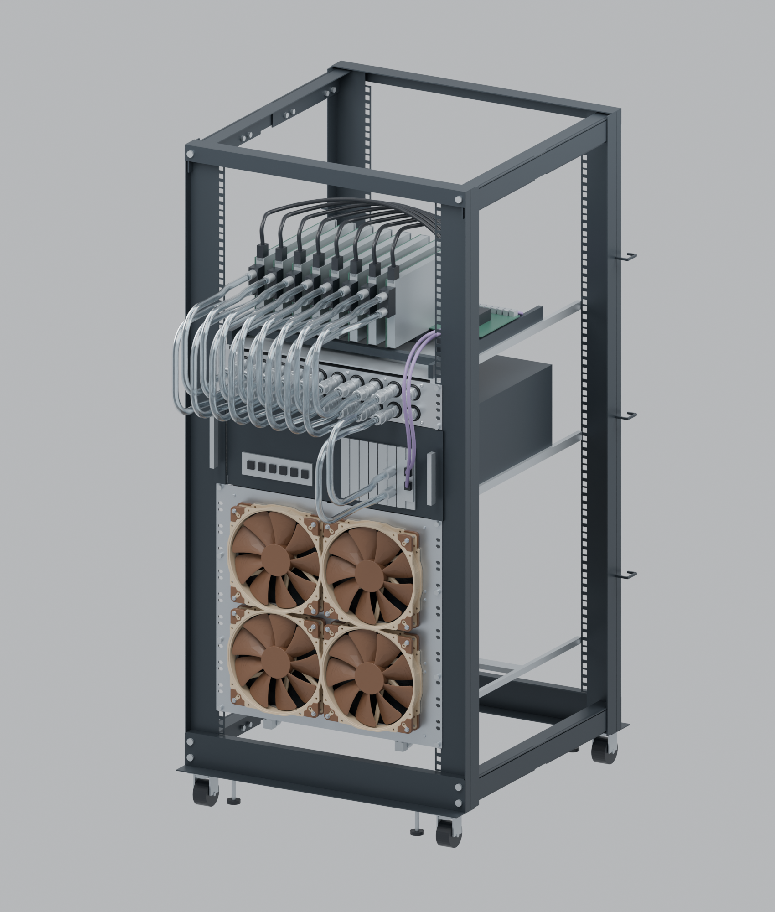

# StarTech 25U installation and PVC routing

The current composite uses the **StarTech 4POSTRACK25U**, replacing the generic 24U rack. Approved custom parts remain **P manifold body, P faceplate and R6 radiator plate**. Eight single-slot waterblocked GPUs connect to front pairs 1–8, the 4U host uses pair 9 and pair 10 is spare. Infrastructure connects at the manifold's left side. No custom-part geometry was changed.

[Orbitable Blender scene](../output/context-25U/25U-StarTech-context.blend) · [front](../output/context-25U/02-front-layout.png) · [rear](../output/context-25U/04-rear-cooling-assembly.png) · [pump/radiator](../output/context-25U/05-pump-reservoir-detail.png) · [front tubing detail](../output/context-25U/06-front-tube-routing.png) · [side tubing detail](../output/context-25U/07-side-tube-routing.png).

## Rack and allocation

| Position, bottom to top | Contents |
|---|---|
| U1 | Clear space for radiator bottom elbows and hoses |
| U2–U11 |10U R6/SuperNova with four NF-A20 fans on each face |
| U12–U15 |4U host with motherboard I/O and PCIe coolant bulkheads facing the service side |
| U16–U17 |2U manifold P |
| U18–U23 | Eight GPUs, retention/riser tray and conceptual PCIe switch |
| U24–U25 |2U service/spare space |

Use the shortest **22 in setting,0/0**, giving 558.8 mm front/rear mounting-plane separation. The manufacturer's dimensioned drawing gives 600 mm width,661.8 mm overall depth at minimum extension,1215.4 mm body height and 1288.34 mm with casters. The frontal clear opening is450 mm; rack-hole columns are465 mm apart. The reference chassis is440×456×176 mm, leaving 5 mm each side and 102.8 mm to the rear mounting plane. Rails/supports remain schematic mounting references, not a selected SilverStone rail kit.

Sources: [official product page](https://www.startech.com/en-gb/server-management/4postrack25u), [dimensioned drawing](https://media.startech.com/downloads/image/4POSTRACK25U_Diagram.pdf), [current manual](https://media.startech.com/downloads/image/4POSTRACKxU_Manual.pdf), and the operator's supplied `Open_Frame_Racks.vssx`. Copies, extracted preview, metadata and hashes are in [the source record](references/startech-25u/sources.json).

The VSSX's `master5.xml` is the 25U front symbol. Its width/height formulas explicitly scale inches by1/10; it contains an embedded front bitmap (`image8.png`) and vector geometry, **not a3D CAD model**. Its vectors locate the lower U datum at142.255 mm above caster ground and depict9.8 mm square holes. Those registration values are useful for this study, not fabrication tolerances. The drawing's1113.9 mm opening is slightly larger than25×44.45=1111.25 mm; the model retains the normal U pitch instead of stretching it.

The side-view591.8 mm upright datum and661.8 mm extremity differ from the 558.8 mm mounting depth. Symmetric registration gives 16.5 mm and 51.5 mm offsets from each mounting plane, respectively; that symmetry is an explicit modelling inference. L-profile sheet sections, beam nesting, castors, cage nuts, hooks and screw detail are simplified reference geometry. The 600 mm width is the bare frame; optional cable hooks project outside it. Older/stencil catalogue values round mounting depths to 560/1017 mm and disagree on maximum overall depth; the dimensioned drawing and inch-derived mounting settings govern this scene. No screen scaling of the PDF was used as a dimension.

## Fit findings

The old radiator-in-U1 layout would place the illustrated bottom elbow about 23 mm below the real base's upper surface. **Reserving U1 and starting the radiator at U2 raises that elbow to21.455 mm above the base-top datum**. This is a vertical envelope check, with the actual tube routes also checked against modelled surfaces. The extra rack unit is used for this clearance; it is not added to the top service reserve.

The 450 mm opening accepts the 410 mm body, but a pair of side elbows is wider than that frontal opening. In service their bodies sit behind the mounting flange and inside the wider frame. This is an installed-position study, not a guarantee that a fully plumbed manifold can be inserted straight through the opening. Assemble side fittings with appropriate access after placing the panel, or separately verify an insertion sequence.

For this installation the manifold populates the existing outer rack slots at local Z5.4/81.6, four rack screws total. Illustrative13×12×13 mm cage-nut envelopes then clear the 18 mm side-elbow bodies vertically by 2.6 mm. The middle-U positions can overlap these conservative nut envelopes; the optional slots are retained rather than claimed universally compatible. All P/R6 CAD stays unchanged. The 465 mm rack columns differ by0.05 mm per side from the plates'±232.55 mm nominal slot centres, within the slots' horizontal allowance.

The outer manifold slots still leave only 1.9 mm steel edge ligament. This rendition uses compactØ10 mm rack-head envelopes, with no cup washers; aØ15 mm cup washer would overhang the plate by2.1 mm. Actual head/washer/cage-nut selection and the neighbouring-U space require physical fit review. No improved load rating is inferred from choosing these slots.

## Open concern: manifold side elbows and cage nuts

**Lodged for physical/CAD fit confirmation:** feasibility of the90° rotary fittings at the manifold side ports is not settled for every cage-nut position. This concerns the manifold's side elbows, not the422mm-wide rotated radiator. P already has a40mm main slab plus3mm bosses; the35mm N proposal was superseded.

The earlier O analysis found2mm nominal clearance with a10×6×10mm illustrative nut centred atY6, whose rear edge wasY9. The present conservative13×12×13mm nut envelope extends toY14.5, using5.5mm more rearward space. That change of hardware envelope explains why the old40mm result cannot be carried forward as universal compatibility. Neither box establishes actual StarTech clip or screw-tail geometry.

A separate [40/45/50mm sensitivity assessment](../output/context-25U/manifold-side-clearance.json) moves centred galleries rearwards without changing the approved CAD:

| Main slab, excluding3mm bosses | Gallery axis Y | Rearward shift from P | Depth gap to current nut envelope at the four inner slots |
|---|---:|---:|---:|
|40mm, approved P |20mm |0 |−3.5mm envelope overlap |
|45mm candidate |22.5mm |+2.5mm |−1.0mm envelope overlap |
|50mm candidate |25mm |+5mm |+1.5mm nominal gap |

The table is the **Y separation**, not an actual collision assertion; the intermediate slot positions also have smaller Z overlaps. The full JSON reports three-dimensional box gaps at all six positions. The outer slots shown in the rendering clear by Z, but are only one provisional assembly choice, with the edge/washer limitations above. They do not close this concern.

A45mm slab does not clear this particular conservative envelope. A50mm slab clears it by only1.5mm before tolerances and screw/clip variation. Neither candidate is approved or a demonstrated solution. More slab depth does not reduce the approximately467.6mm side-fitted width or solve the450mm insertion opening. Obtain the actual cage nut, selected screw length, rotary elbow and compression fitting geometry, check their installed and rotation/insertion envelopes, then choose whether to retain40mm or formally revise P.

## Transparent PVC tubes

The 18 branch hoses are **10 mm ID /13 mm OD**, matching QD3-FT10X13. Three infrastructure hoses use **10 mm ID /16 mm OD** and matching illustrative compression envelopes. Both are modelled as real annular walls containing a separate clear coolant volume, rather than opaque coloured cylinders.

[Koolance HOS-10CL-3M](https://koolance.com/tubing-clear-uv-reactive-pvc-10mm-x-13mm-3-8in-x-1-2in-3m) publishes approximately 37 mm bend radius for its 10/13 PVC. The branch layout uses 55 mm centre-line bends and30 mm straight lead-outs before lateral transitions. Each pair separates into two lateral lanes, then returns to the GPU or chassis port axes. The host hoses now follow broad downward loops instead of AUTO-handle curves that can overshoot or reverse.

Infrastructure uses 65 mm centre-line bends. [Alphacool AlphaTube HF16/10,17496](https://shop.alphacool.com/en/shop/tubes/tube1610mm/s16-alphacool-hose-alphatube-hf-16/10-3/8-quot-id-ultra-clear-1m-3.3ft-retail-box-100cm) supplies a clear PVC option, but the reviewed page gives no numerical bend limit.65 mm is therefore a layout allowance, not a manufacturer-approved limit for every16/10 hose. Its3 mm wall differs from the1.5 mm branch wall; formulation/hardness also matters, so their stiffness and kink behaviour must not be treated as interchangeable.

The longest front excursion is approximately 276.5 mm from the rack mounting plane, including tube radius. This is the illustrated routing envelope, not an approved minimum service clearance. Actual cut lengths, gravity/sag, installed temperature, ageing and slack should be checked on a sample assembly. Keep the manufacturer's actual compatible clear inhibited coolant requirement in the eventual tubing selection.

## Checks and scope

- All 21 centre-lines pass tangent continuity, fitting-axis alignment, no backtracking, nonlocal self-overlap and inter-tube separation checks. Minimum sampled curvature radius is55 mm for branches and 65 mm for infrastructure.
- Minimum conservative tube-to-tube outer-surface gap is approximately 6.00 mm. The calculation subtracts both tube radii and sampling uncertainty; the exact same points produce the meshes.
- Mesh proximity checks found no unintended tube/equipment or tube/cable intersection. Fitting/barb insertion interfaces are excluded by owner. The smallest sampled equipment gap is approximately 4.97 mm at the pump support; allow another 0.5 mm for centre-line sampling.
- P body/plate and R6 source imports, official Koolance solids, twelve P retainers, eight NF-A20 frames and two MCIO cables are inventoried. See [scene verification](../output/context-25U/scene-verification.json), [tube checks](../output/context-25U/tube-verification.json) and [layout/source hashes](../output/context-25U/layout.json).

The routes are geometric layouts, not an elastic-tube simulation or a hot-coolant kink/creep qualification. Modelled rack section details and bought-in host/GPU/pump envelopes are not toleranced manufacturer solids. The checks establish nominal visual integration only, not complete fit, airflow, transport or load certification.

GPU brackets still face rear; coolant and12VHPWR are at the non-bracket end. The host has one logical x16 upstream link over two MCIO8i cables. The eight-endpoint PCIe switch remains conceptual until a specific board is selected. The provisional ULTITUBE200/D5 NEXT moves toY285 behind the fans on independent rack support; its mounting remains illustrative. No140 mm fan adapter is invented on an occupied200 mm fan plate.

Rebuild with `scripts/render_context_25u.py -- --device METAL`; see [rebuild instructions](rebuild.md). The saved viewport opens centred on the rack with 5 mm near clipping. Use Blender to rotate and inspect; separate generated sketches are not maintained. The old generic scene and its renderer remain historical under `output/context-24U/` and `scripts/render_context_24u.py`.
