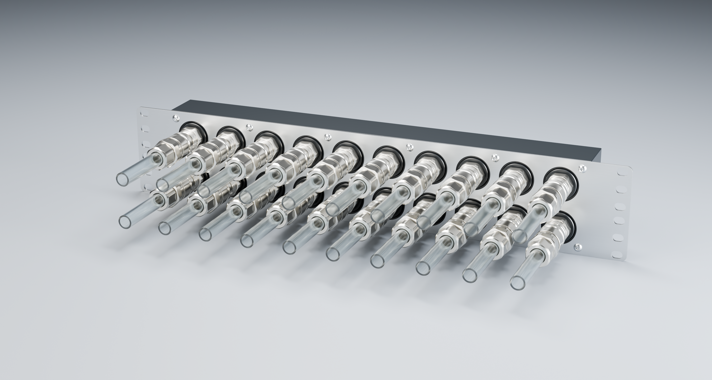

# Current product views

## Accepted manifold Q / manufacturing detail Q-M01

The updated scenes use the40 mm slab,3 mm bosses,2 mm plate,28 G1/4 ports and shortened13 mm M4 pilots. Twelve ISO7380-1 button heads represent the selected M4×10 hardware; hidden screw shanks are omitted. No product markings are added.

| Studio view | Image |
|---|---|
| Bare front | [Front three-quarter](../output/long-bore-Q/photorealistic/01-bare-ports.png) |
| Official Koolance QD3-MTG4 +QD3-FT10X13,10/13 tubes | [Connected front](../output/long-bore-Q/photorealistic/02-qd3-translucent-tubes.png) |
| Bare rear ports | [Rear three-quarter](../output/long-bore-Q/photorealistic/03-bare-rear.png) |
| Connected configuration, unused rear ports plugged | [Rear three-quarter](../output/long-bore-Q/photorealistic/04-connected-rear.png) |

[Connected studio Blender](../output/long-bore-Q/photorealistic/02-qd3-translucent-tubes.blend) · [bare studio Blender](../output/long-bore-Q/photorealistic/01-bare-ports.blend). Koolance source meshes and accepted inferred coupled placement are retained unscaled from the [P reference integration](koolance-qd3-studio-integration.md). Rear plugs are simple visual envelopes, not exact bought-in models. These existing studio shaders show horizontal satin grain; both production plates now specify raw sheet finish without brushing.

The [unmarked review scene](../output/long-bore-Q/product-views/assembled-unmarked.blend) has ten inspection views: rear assembly/elevation, front perspective/elevation, bare POM rear, left/right, top/bottom and [50% transparency with diagnostic gallery volumes](../output/long-bore-Q/product-views/05-POM-transparent-channels.png). [Separate transparent Blender file](../output/long-bore-Q/product-views/body-50-percent-transparent.blend). Actual POM is opaque. Review views expose rear ports intentionally; the connected studio and rack scenes close unused rear ports.

## R6 radiator / R6-M02 finish

[Plate perspective](../output/radiator-R6/01-plate-perspective.png) · [front](../output/radiator-R6/00-plate-front.png) · [notch](../output/radiator-R6/05-cable-notch-detail.png) · [native Blender scene](../output/radiator-R6/radiator-rack-plate-R6.blend). R6-M02 leaves the geometry intact. The operator subsequently selected raw sheet finish for both steel parts. Existing presentation images illustrate geometry; their directional satin shader is not the production finish specification.

The [StarTech25U composite](context-25U.md) combines Q and R6 with official Noctua and Koolance references, the accepted GPU/host tube routes, corrected5090 block/power geometry and provisional pump support. Nine context views and the orbitable Blender file are refreshed. Desktop Blender is not needed to generate them and should remain closed when not being used.

See [rebuild instructions](rebuild.md). Historical P studio files remain intact as source/acceptance evidence, not the current product.
