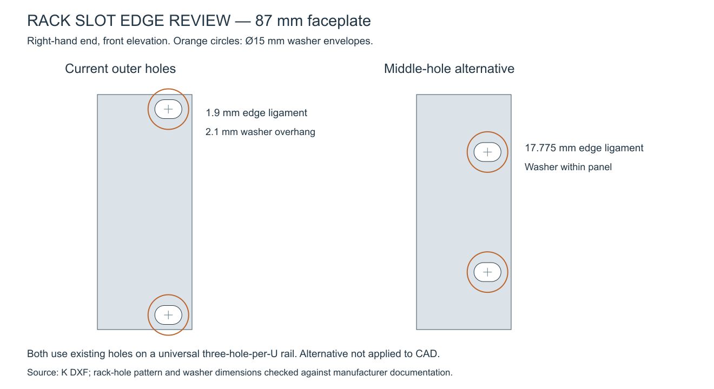

# Rack-fixing slot edge review — Revision K

The observed small top/bottom margin is real. Reading the four slots from K's cut DXF confirms **1.9 mm of steel between the slot and the nearest horizontal plate edge**. The same inherited rack-slot geometry appears in the preceding manifold revisions.

| Dimension | Current K |
|---|---:|
| Plate height / thickness | 87 / 3 mm |
| Rack-slot size | 10 mm horizontal × 7 mm vertical |
| Rack-slot centre heights from plate bottom | 5.4 / 81.6 mm |
| Centre distance to nearest top/bottom edge | 5.4 mm |
| Slot-edge distance to nearest top/bottom edge | **1.9 mm** |
| Slot-edge distance to nearest side edge | 3.75 mm |

The height positions match actual rail holes; the problem is not a hole-pitch error. A universal rack rail has three holes per U, with 0.625 inch spacing within a U and 0.5 inch across a U boundary. Our 87 mm faceplate is centred in an 88.9 mm 2U allocation, and the chosen outermost holes lie only 5.4 mm from its edges. See [Gator's mounting-pattern explanation](https://gatorcases.zendesk.com/hc/en-us/articles/360039820193-Why-won-t-my-rack-gear-line-up-to-your-rails-Are-all-the-holes-in-my-rack-rails-supposed-to-be-spaced-equally) and [Dell's rack installation guide](https://dl.dell.com/manuals/all-products/esuprt_ser_stor_net/esuprt_powervault/powervault-745n_setup%20guide_en-us.pdf).

## Hardware footprint

A representative [Penn Elcom S1940 M6 cup washer](https://www.penn-elcom.com/slim-m6-black-plastic-cup-washer-s1940) has 15 mm outside diameter. Centred in the existing slot, it would project **2.1 mm beyond the top or bottom edge**. Two such washers on matching outer holes immediately across a U boundary would have 12.7 mm between centres and 15 mm combined radii, giving 2.3 mm nominal overlap of their front-view envelopes. Actual interference depends on the adjacent equipment, washer locations and front-face depths.

Even the illustrative Ø11 mm rack screw head in the previous rack render extends 0.1 mm beyond the nominal plate edge. The ordinary product renders omit rack screws, so they do not reveal the full hardware footprint. This is separate from the M4 countersunk screws that retain the POM body.

A 1.9 mm ligament provides little edge reserve, but it alone does not establish a failure load. Edge tear-out, local bending, screw bearing, joint friction and hose/handling loads have not been qualified. Increasing plate thickness does not resolve washer overhang; increasing the height within a 2U allocation gives only a small improvement.

## Recommended layout to evaluate

Use the **middle rack hole in each of the two U positions**, moving each slot inward by 15.875 mm rather than an arbitrary offset. On the existing 87 mm plate this gives **Z = 21.275 and 65.725 mm**, with 44.45 mm vertical fixing separation. The top/bottom slot-edge margin becomes **17.775 mm**, and a centred Ø15 washer remains 13.775 mm inside those edges. Horizontal positions, slot dimensions and faceplate thickness can remain unchanged.

The proposed nut positions were checked against K's existing four elbow/compression STEP envelopes. The illustrative 10 × 6 × 10 mm nut bodies at Y = 6 mm remain **8 mm clear** of the fittings, through depth separation, despite moving close to the port-row heights. Actual cages, screw tails and rail folds still need their own check. The reduced vertical fixing spread also changes the joint's response to an applied moment; the larger edge margin is not a complete structural qualification. The alternative assumes universal three-hole-per-U rails, not historical two-hole wide-spacing rails.

**No CAD change has been made in this assessment.** The recommendation is to replace the current outermost rack slots with these middle-hole locations in the next layout update, then update the rack render/nut placement and associated clearance checks together.

[Computed assessment](../output/rack-slot-review/assessment.json) · [Reproducible check](../scripts/check_rack_slot_edges.py)

## Six holes per side

Providing all six universal-rail positions in each 2U side produces twelve rack-fixing holes total, at Z = 5.4, 21.275, 37.15, 49.85, 65.725 and 81.6 mm. If all twelve compatible fasteners are installed and appropriately tightened, the additional attachment points can distribute joint loads and reduce local movement. The larger vertical fixing spread can also improve resistance to an applied moment. Those are possible joint benefits, not a quantified increase in the capacity of the complete manifold mount; the plate, POM retention and rail connections still govern the load path.

Unpopulated extra holes add no clamping or fastening capacity and remove material from the steel. With our 7 mm-high slots, the material between adjacent slots is 8.875 mm within each U and 5.7 mm across the centre U boundary. The outer slots still retain the same 1.9 mm top/bottom edge ligament; additional screws do not increase that dimension.

All six positions cannot simultaneously use the example Ø15 mm S1940 cup washers in one plane: the two middle positions are only 12.7 mm apart, causing 2.3 mm overlap. The outer washers also retain their 2.1 mm overhang. Smaller compatible hardware could avoid the washer clash, but a circular footprint must be no more than 10.8 mm diameter to stay entirely within the current outer panel edges, before tolerances.

For the current design, two middle fixings per side remain the preferred starting layout for evaluation. A fully populated six-per-side arrangement may be useful if a defined load case warrants it, but it is not an automatic structural upgrade and does not resolve the original edge-margin concern. No CAD change or load-rating claim follows from this comparison.
