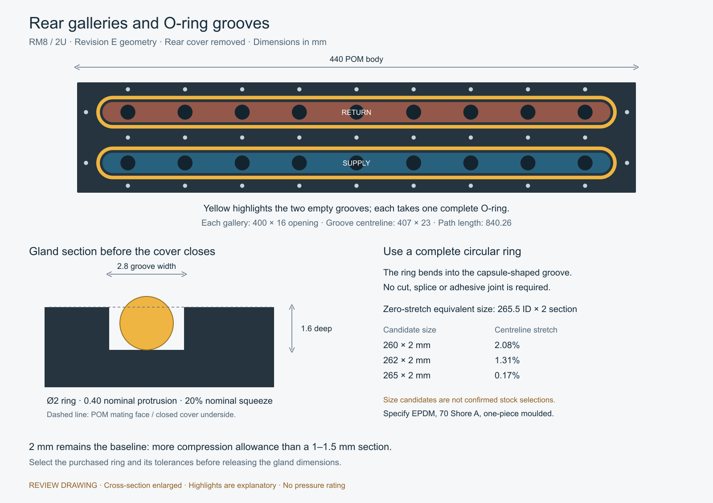

# Rear grooves and purchased O-rings

The current design uses one complete ring around each uninterrupted gallery. A circular O-ring can be laid into an elongated capsule groove: the free ring does not need to be manufactured in the final capsule shape. Prefer purchased one-piece moulded EPDM rings, without user-cut or glued joints.

## Revision E baseline

Each groove centreline is 407 × 23 mm overall, with R11.5 ends and a perimeter of 840.26 mm. The groove is 2.8 mm wide × 1.60 mm deep, intended for a 2 mm section. The nominal uncompressed protrusion is 0.40 mm and squeeze is 20%, before ring stretch, tolerances and coolant swelling. A 1 or 1.5 mm ring cannot seal in this 1.60 mm-deep groove; either requires a shallower gland.

| Section | Illustrative depth at 20% squeeze | Free protrusion | Squeeze lost to 0.05 mm additional gap |
|---|---:|---:|---:|
| 1 mm | 0.80 mm | 0.20 mm | 5 percentage points |
| 1.5 mm | 1.20 mm | 0.30 mm | 3.33 percentage points |
| 2 mm | 1.60 mm | 0.40 mm | 2.5 percentage points |

This is why 2 mm is a useful initial choice for the long cover. Section alone does not establish a pressure rating.

For a free circular ring, centreline circumference is π × (ID + section). Equating this to the groove path gives a zero-stretch equivalent of **265.46 mm ID × 2 mm section**. Illustrative 260, 262 and 265 × 2 mm rings would have nominal centreline elongations of 2.08%, 1.31% and 0.17%, respectively. These are dimensional candidates, not confirmed stocked EPDM products. Ring ID tolerances matter particularly for the near-zero-stretch option. Pressure moves the ring towards the outer groove wall, so this nominal centreline calculation is only an initial sizing check.

## RS UK stock checked through Computer Use

Checked 14 September 2026 on the RS website, using the material, thickness, diameter and availability filters and then the product page. No order was placed.

| Item | Verified product-page information |
|---|---|
| Product | [RS PRO 258-0460](https://uk.rs-online.com/web/p/gaskets-o-rings/2580460) |
| Free size | **253.59 mm ID × 3.53 mm section**, 260.65 mm OD |
| Standard | AS568-274 / BS 1806-274 |
| Material | EPDM; range labelled 70 ShA, specifications list 71 IRHD |
| Pack | 2 rings |
| Indicative price | £4.92 per bag excluding VAT; £2.46 per ring |
| Availability displayed | **24 unit(s) ready to ship** |
| Delivery check | Default quantity 1 displayed delivery on 16 September 2026 |

RS uses “Bag(s)” for ordering and “unit(s)” in its stock/delivery wording. Preserve the stock wording rather than assuming the counter means 24 bags. The displayed inventory is sufficient for an initial prototype; it is not a guarantee of recurring supply. RS sells this as a complete O-ring. Its product page did not explicitly establish the manufacturing/joining method, so confirm one-piece moulded construction if that is a mandatory purchase requirement.

**This is the useful stocked large-ring candidate found, but it requires a design change.** Its free centreline circumference is 807.77 mm, giving about 4.02% elongation on the existing 840.26 mm centreline. More decisively, its 3.53 mm section is incompatible with the existing 2.8 × 1.60 mm gland. A redesign must set groove width/depth, path and corner radius around the actual ring tolerances, then recheck the sealing lands, outer walls and nearby screw bores. A slightly shorter gallery could reduce ring elongation while retaining uninterrupted parallel flow; port-to-pocket clearance must be checked before committing that change. Neither this note nor the review image changes the manufactured CAD.

The checked nearby 250, 266.3 and 266.29 mm EPDM selections returned no in-stock results. The 260 mm selection showed a [260 × 3 mm Hutchinson ring, RS 058-1630](https://uk.rs-online.com/web/p/gaskets-o-rings/0581630), supplied on demand rather than RS stock. The 2 mm in-stock results did not establish a drop-in ring near the required circumference. This is a bounded catalogue check, not proof that RS can never supply a suitable 1–2 mm section.

Recommendation: retain the 2 mm geometry as the current model, but use RS 258-0460 as the concrete alternative if dependable initial availability from RS takes priority over the preferred section. Do not order it as a replacement for the current CAD seal.

## Design references and reproduction

- [Parker O-Ring Handbook](https://www.parker.com/content/dam/Parker-com/Literature/O-Ring-Division-Literature/ORD-5700.pdf): static face seals and non-circular groove guidance. Check corner radii, squeeze, fill and tolerances against the chosen ring.
- [PTM size catalogue](https://epdm.co.uk/wp-content/uploads/2024/08/O-Rings-Data-Sheet.pdf): includes a 262 × 2 dimension, but does not establish current EPDM stock. Do not apply its standard NBR tolerance table to an EPDM purchase without confirmation.
- `scripts/draw_rear_seals.py` reads the current CAD parameters and writes the review SVG and `output/analysis/rear-seal-sizing.json`. Rasterise with `rsvg-convert output/rear-seal-review.svg -o output/images/rear-seal-review.png`.

The circular section drawn in the detail is **before closure**. The closed cover compresses it into the gland. Final pressure capability still depends on cover stiffness, retained preload, POM creep and the selected coolant/temperature conditions.
