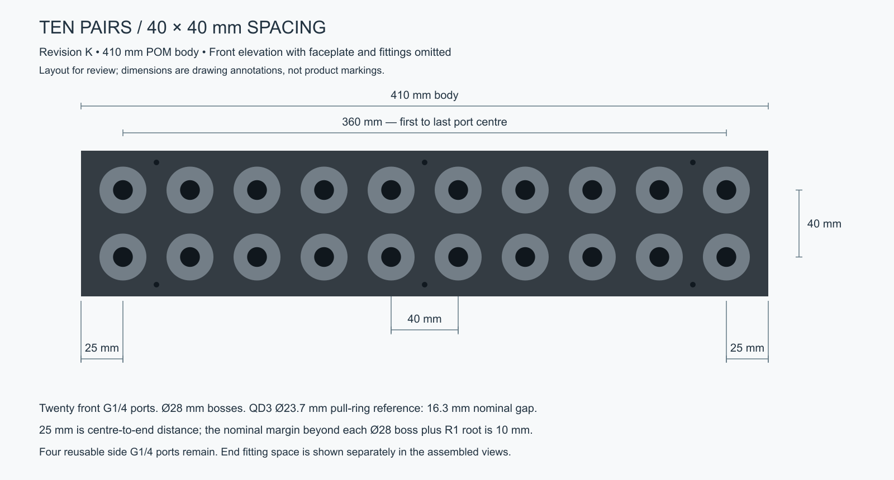
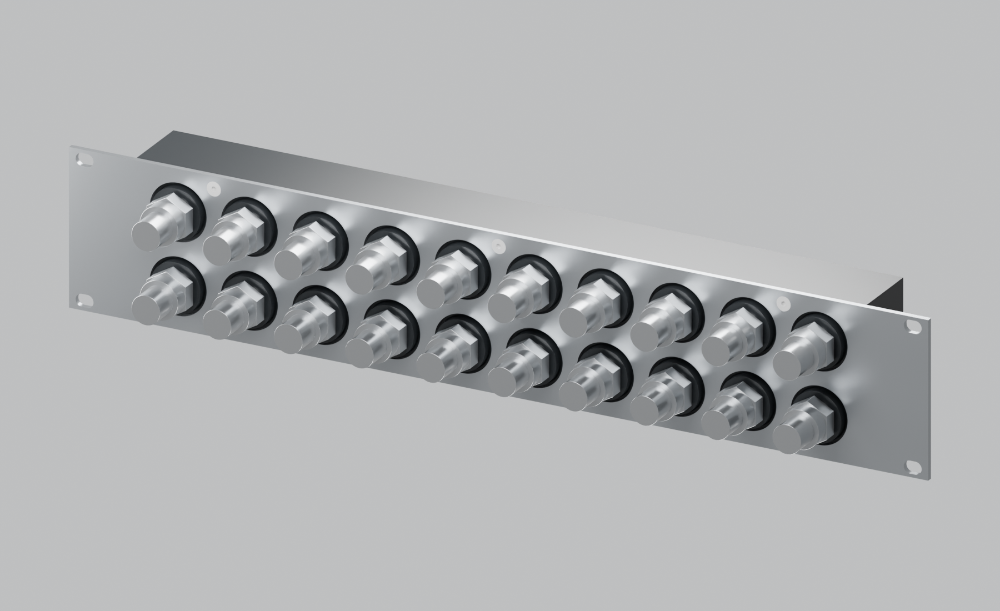
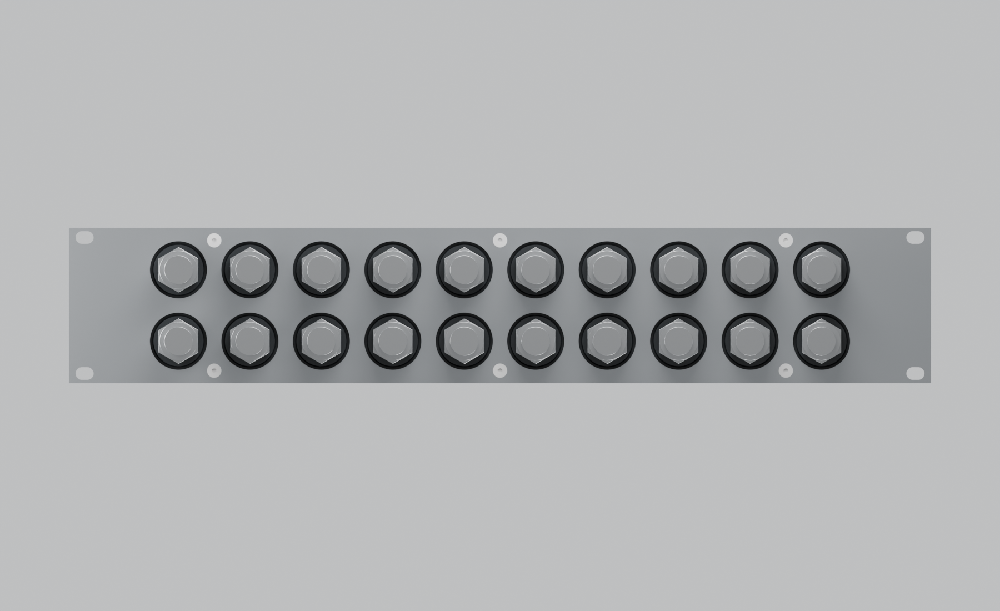
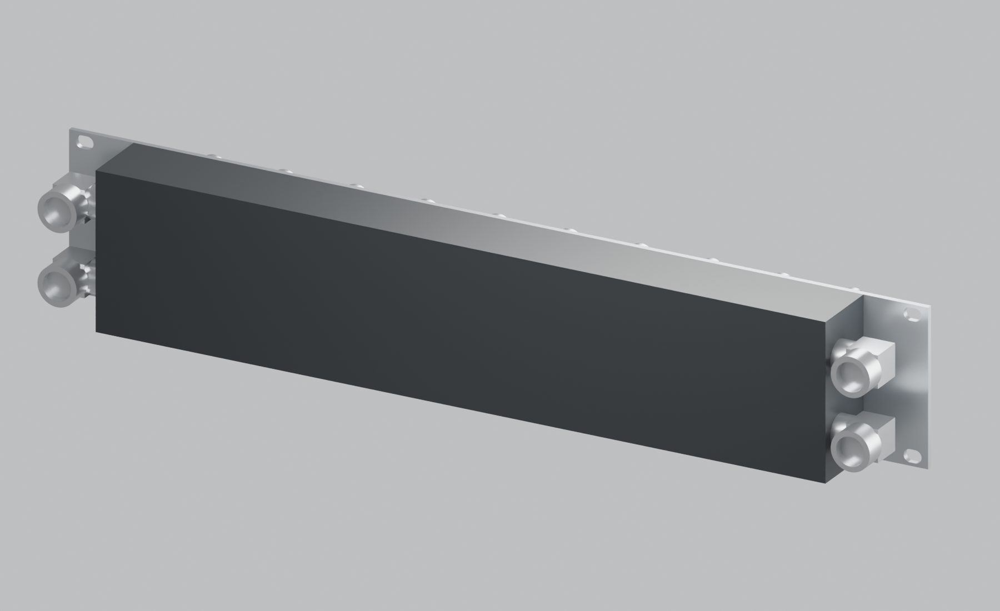
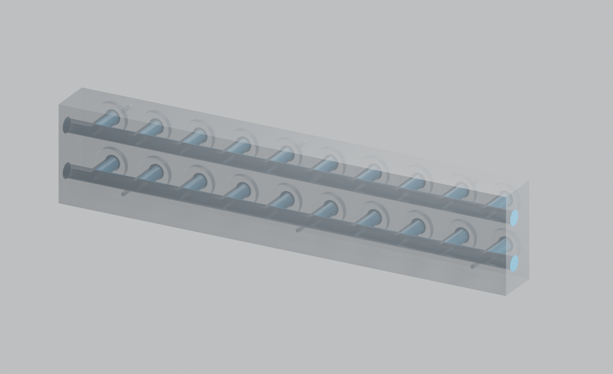

# Revision K — ten pairs at 40 mm spacing

This is a visual review candidate using the proposed **410 × 40 × 87 mm POM body**. Twenty front G1/4 ports form ten pairs at **40 mm centre-to-centre horizontally and vertically**. The outer port centres span **360 mm**, leaving **25 mm from each outer centre to the body end**. The user wants to judge that end space visually before deciding whether it is sufficient.











The 25 mm dimension is centre-to-edge, not clear material beyond the boss. Each Ø28 boss and R1 root leaves a nominal **10 mm end margin**. The front QD3 pull-ring reference envelopes leave **16.3 mm edge-to-edge clearance** in both directions. The product views show manifold-side male QD references; the female pull rings are not installed in those views.

Six M4 front-plate screws are placed at X = −160, 0, +160 and Z = 7, 80 mm. Two uninterrupted Ø11.8 galleries and four reusable side G1/4 ports remain, with no rear plate or large gallery O-rings. Side-fed supply/return allows all ten front pairs to serve systems. The plugged configuration starts with four side plugs; the alternative rear view shows all four end fitting envelopes.

The elbow/compression references span **467.6 mm** across the 410 mm body. They extend beyond the assumed 450 mm front opening, but the preceding [3D rack-envelope study](ten-pair-feasibility.md) found them clear of the illustrative frame and corner nuts at their actual heights/depths. This is not an installed-fit or insertion-path qualification for a specific rack.

The new CAD preserves the previous port, boss, drilling and screw specifications. Its end-margin layout checks use 10 mm beyond the boss roots and greater than 10 mm between the reference plug tip and nearest front-thread lateral envelope. These replace the wider earlier variants' 20 mm layout thresholds for this candidate; they are not material-strength limits. The minimum axial gap from the specified 8 mm full end-thread zone, after its 1 mm entry lead-in, to the nearest Ø11.8 front drill envelope is 10.1 mm. Deep-drilling capability, threads, seal lands, actual fitting geometry and loads still require manufacturing review.

- [Assembly STEP](../output/long-bore-K/cad/manifold-assembly.step), [POM STEP](../output/long-bore-K/cad/body.step), [front plate STEP](../output/long-bore-K/cad/faceplate.step), [front plate cut DXF](../output/long-bore-K/cad/faceplate-flat.dxf).
- [Editable assembled Blender scene](../output/long-bore-K/product-views/assembled-unmarked.blend), [transparent inspection scene](../output/long-bore-K/product-views/body-50-percent-transparent.blend).
- [Parameters](../cad/iterations/K-long-bore.json), [geometry checks](../output/long-bore-K/cad/verification.json), [render manifest](../output/long-bore-K/product-views/render-manifest.json).

K is a separate iteration. I/J parameters and outputs remain unchanged; I's original CAD/product baseline is tagged `revision-i-390mm` at `fcc3d5a`.

```sh
.venv/bin/python scripts/build_long_bore.py --iteration K
.venv/bin/python scripts/draw_ten_pair_layout.py
rsvg-convert output/long-bore-K/front-spacing.svg -o output/long-bore-K/front-spacing.png
/Applications/Blender.app/Contents/MacOS/Blender --background --python scripts/render_product.py -- --iteration K
```
