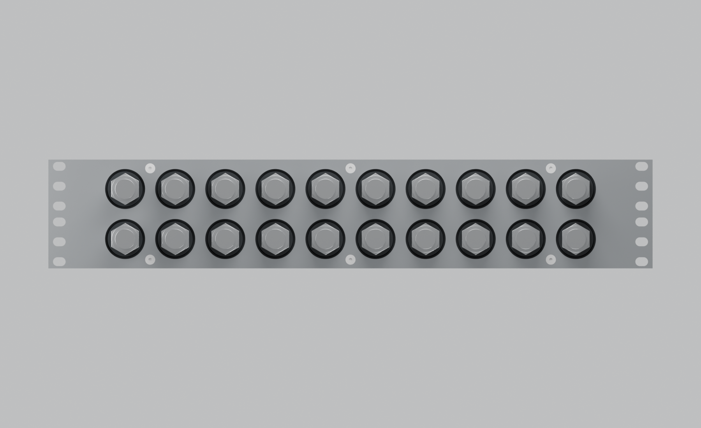
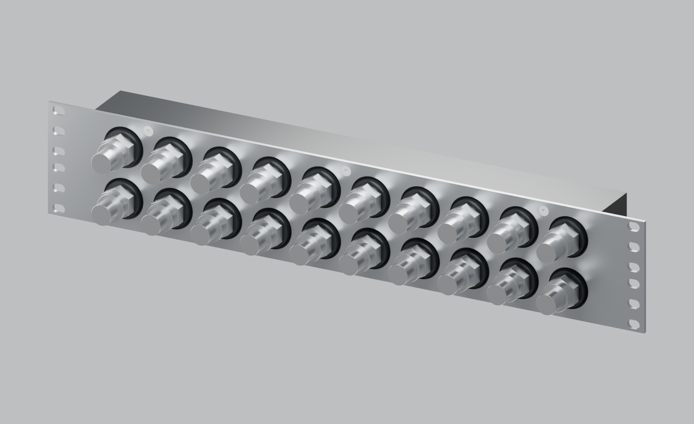

# Revision L — six rack positions per side

Revision L provides **six available rack-fixing slots on each side**, twelve in total. Builders can select which positions to populate; the hole pattern does not require six screws per side. The renders leave rack slots empty so all positions are visible.

The ten front pairs remain at 40 × 40 mm spacing, on the same 410 × 40 × 87 mm POM body as K. Six M4 countersunk screws continue to retain the POM to the 3 mm stainless faceplate. Galleries, front ports, side ports, bosses and end fittings are unchanged.

Each side has 10 × 7 mm horizontal slots at Z = **5.4, 21.275, 37.15, 49.85, 65.725 and 81.6 mm**, aligned to the universal three-hole-per-U pattern. Their horizontal centres remain X = ±232.55 mm. More available holes give mounting choices; joint stability and capacity depend on the populated screws, hardware and loads. The existing outer-slot edge margins and washer-footprint considerations remain documented in the [rack-slot assessment](rack-slot-edge-review.md).

- [Editable Blender scene](../output/long-bore-L/product-views/assembled-unmarked.blend).
- [Assembly STEP](../output/long-bore-L/cad/manifold-assembly.step), [faceplate STEP](../output/long-bore-L/cad/faceplate.step), [faceplate cut DXF](../output/long-bore-L/cad/faceplate-flat.dxf).
- [Parameters](../cad/iterations/L-long-bore.json), [geometry verification](../output/long-bore-L/cad/verification.json).
- [Rear view with side elbows](../output/long-bore-L/product-views/11-side-elbow-configuration.png), [transparent channel view](../output/long-bore-L/product-views/10-body-50-percent-transparent.png).

The earlier K layout and all its outputs remain preserved. Rebuild L using `scripts/build_long_bore.py --iteration L` with the project Python environment, followed by `scripts/render_product.py --iteration L` through Blender's script arguments.
