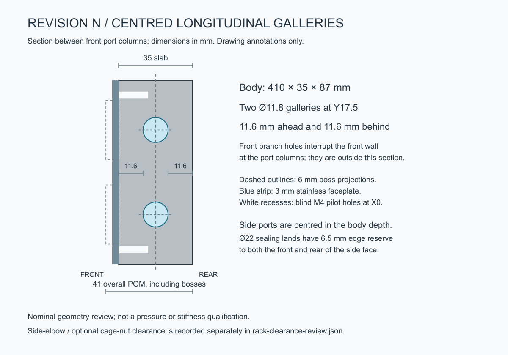

# Revision N — 35 mm body with centred galleries

Historical assessment, superseded by [the selected 40 mm Revision O](revision-O-centred-40mm.md) after reviewing side-elbow clearance.

The POM slab is now **410 × 35 × 87 mm**, excluding its 6 mm front bosses. Overall POM depth is **41 mm**. Both Ø11.8 longitudinal galleries lie at **Y17.5**, leaving **11.6 mm nominal material ahead and behind**, away from the front branch intersections. The side ports are centred on the 35 mm end faces, with 6.5 mm front/rear edge reserve around the Ø22 sealing lands.

The front branch drilling now ends at Y17.5 before its nominal drill point, whose tip reaches Y21.045. Eight millimetres of full G1/4 thread remain specified from each boss face. The front port locations, bosses, six M4 fixings and twelve optional rack slots are unchanged. The exported faceplate was checked against M and is geometrically identical.

The complete CAD checks pass: valid connected POM/steel solids, two separate uninterrupted fluid networks, twenty connected front ports, four reusable side ports and no plug/body interference. The minimum conservative M4 thread-envelope distance to the complete wet network is **9.016 mm**. The old axial separation shortcut has been replaced by the existing full 3D clearance check, because M4 holes and galleries can share part of their depth range while remaining separated vertically.

## Side-fitting clearance consequence

The side ports move forwards by 8.5 mm compared with M. Four rearward elbow/compression envelopes still clear the illustrative rack front flanges by 5.5 mm and folded returns by 23.2 mm. They clear the illustrative nuts at the two outermost slot heights by 4.1 mm, but overlap the conservative nut boxes at the four other optional heights. The overlap in depth is only 0.5 mm; actual elbow contours, cage clips and screw tails need checking before claiming those combinations fit.

These are optional nut positions, not twelve assumed installed screws. All slots remain available, and the normal side-plug configuration is unchanged in purpose. Existing concerns about washer overhang at the outermost slots remain; clearance to an elbow does not resolve those edge concerns. This revision does not establish an insertion path, a specific rack fit or a pressure/stiffness rating.

## Files and regeneration

- [Parameters](../cad/iterations/N-long-bore.json), [assembly STEP](../output/long-bore-N/cad/manifold-assembly.step), [POM STEP](../output/long-bore-N/cad/body.step), [faceplate STEP](../output/long-bore-N/cad/faceplate.step), [faceplate cut DXF](../output/long-bore-N/cad/faceplate-flat.dxf).
- [Dimensioned section SVG](../output/long-bore-N/depth-section.svg), [geometry verification](../output/long-bore-N/cad/verification.json), [rack-envelope review](../output/long-bore-N/rack-clearance-review.json).
- [Assembled Blender model](../output/long-bore-N/product-views/assembled-unmarked.blend), [angled assembly](../output/long-bore-N/product-views/01-front-three-quarter.png), [side view](../output/long-bore-N/product-views/05-left.png), [50% transparent inspection](../output/long-bore-N/product-views/10-body-50-percent-transparent.png), [side-elbow configuration](../output/long-bore-N/product-views/11-side-elbow-configuration.png).

Build with `scripts/build_long_bore.py --iteration N`; render through Blender using `scripts/render_product.py --iteration N`; generate the section using `scripts/draw_depth_section.py --iteration N`; check the illustrative rack using `scripts/check_long_bore_rack.py --iteration N`. Rendered surfaces remain unmarked. Threads and purchased hardware remain simplified representations.

Revision M is preserved under `revision-m-before-centred-depth` at `b76fc7e`, including its separate studio presentations. This new iteration has standard CAD review renders; the M studio files still represent M.
