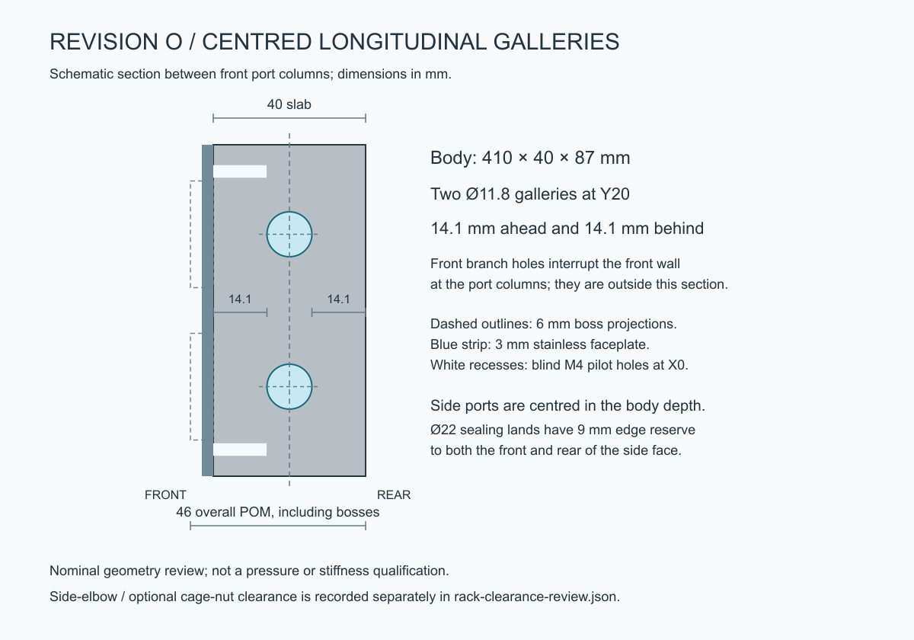

# Revision O — 40 mm body with centred galleries

The selected POM slab is **410 × 40 × 87 mm**, excluding the integral 6 mm bosses. Overall POM depth is **46 mm**. Two Ø11.8 longitudinal galleries are centred at **Y20**, leaving **14.1 mm nominal material ahead and behind**, away from branch intersections. This restores the 40 mm slab depth while retaining the centred side-port appearance.

The front branch drilling ends at Y20, with nominal drill points reaching Y23.545. The Ø22 side sealing lands have 9 mm edge reserve towards both the front and rear of the body. Front bosses, twenty front ports at 40 × 40 mm pitch, six M4 retention screws and twelve optional rack slots remain unchanged. The front plate is geometrically identical to M.

All built-in geometry checks pass, including two separate connected fluid networks, every branch connection, plug/body separation and M4 clearance to the complete wet network. The minimum conservative M4-envelope clearance is 9.792 mm. These are geometry checks, not a pressure, creep or stiffness qualification.

Moving the side ports from N's Y17.5 to Y20 removes the conservative side-elbow/cage-nut overlaps. All six optional nut positions per side now clear the illustrative envelopes: minimum 2 mm at the inner four positions and 4.562 mm at the outer two. Minimum elbow clearance to the rack front flange is 8 mm; to its folded return, 23.2 mm. These checks use simplified nut boxes and conservative elbow heads, not actual cage clips, screw tails, tolerances, insertion sweeps or hose routes. They do not resolve the previously recorded washer overhang at the outermost slots.

- [Parameters](../cad/iterations/O-long-bore.json), [assembly STEP](../output/long-bore-O/cad/manifold-assembly.step), [POM STEP](../output/long-bore-O/cad/body.step), [faceplate STEP](../output/long-bore-O/cad/faceplate.step), [faceplate DXF](../output/long-bore-O/cad/faceplate-flat.dxf).
- [Section SVG](../output/long-bore-O/depth-section.svg), [geometry checks](../output/long-bore-O/cad/verification.json), [rack-envelope checks](../output/long-bore-O/rack-clearance-review.json).
- [Editable assembly](../output/long-bore-O/product-views/assembled-unmarked.blend), [angled view](../output/long-bore-O/product-views/01-front-three-quarter.png), [side view](../output/long-bore-O/product-views/05-left.png), [50% transparent body](../output/long-bore-O/product-views/10-body-50-percent-transparent.png), [elbow configuration](../output/long-bore-O/product-views/11-side-elbow-configuration.png).

Regenerate using `scripts/build_long_bore.py --iteration O`, Blender `scripts/render_product.py --iteration O`, `scripts/draw_depth_section.py --iteration O`, and `scripts/check_long_bore_rack.py --iteration O`. Product surfaces remain unmarked. M's separate studio presentations still represent M; O has fresh standard CAD review views.

The rejected 35 mm centred candidate is preserved as N under `revision-n-35mm-centred` at `d102208`. Earlier M geometry and presentations remain preserved. O is the selected iteration.
